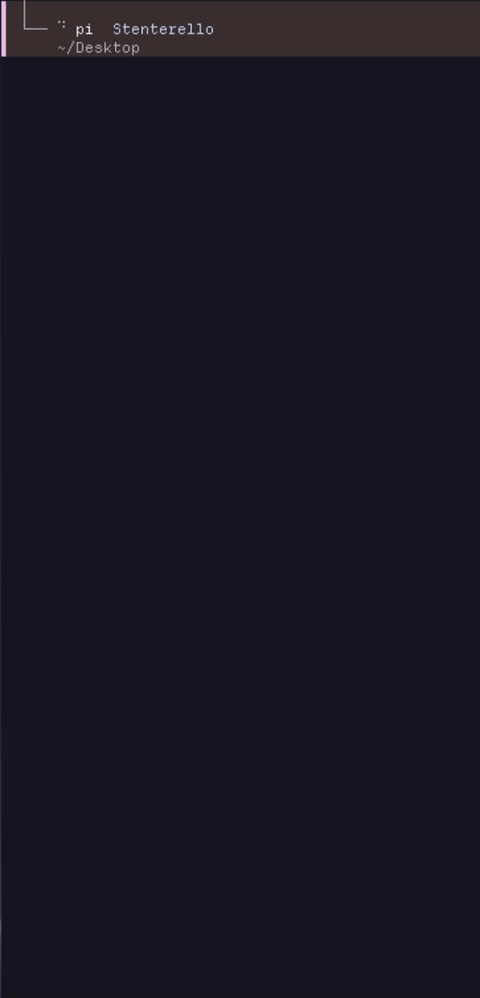
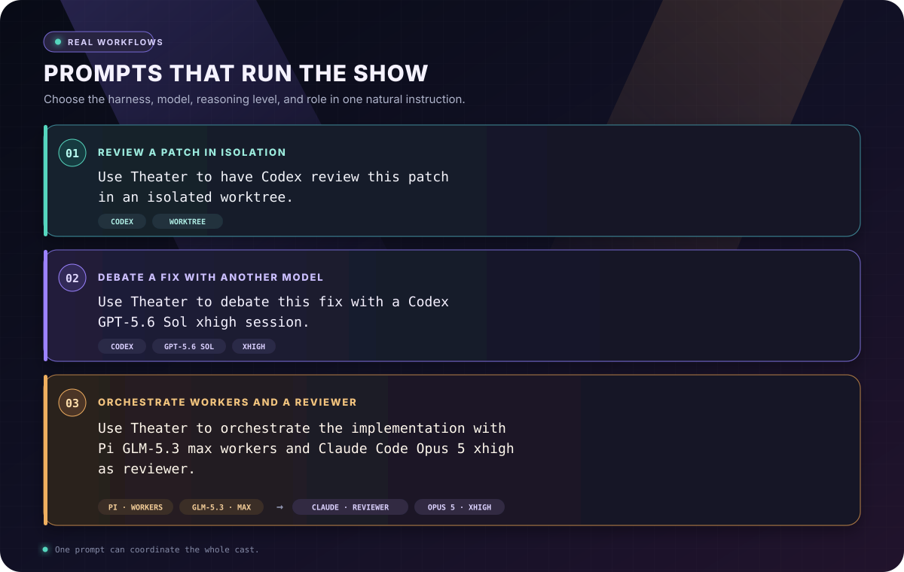

<div align="center">

<h1>🎭 Theater</h1>
<h3>Local cross-harness orchestration for coding agents.</h3>
<p>
Run the whole show from one terminal.
</p>
<p>
<a href="https://github.com/mana-byte/theater/actions/workflows/ci.yml"></a>
<a href="https://github.com/mana-byte/theater/releases"></a>
<a href="https://www.python.org/"></a>
<a href="https://github.com/tmux/tmux"></a>
</p>


</div>

Theater lets Claude Code, Codex, opencode, Pi, and Vibe work together on your
machine. Any agent can spawn, manage, and communicate with other harnesses,
coordinating work across CLI boundaries while you follow the entire tree from
one live control view.

Open any agent's real terminal, inspect its tools and results, and keep an eye
on usage without replacing the CLIs you already use. Their accounts,
permissions, and sessions remain their own; Theater gives them one stage—and
gives you the control room.

## 🎬 See it in action

https://github.com/user-attachments/assets/c6a7d3f4-5d31-4ad6-93f3-8fdd391c5c5b

<table>
<tr>
<td width="50%" valign="top">
<a href="docs/assets/regie-overview.png"></a>
<h3 align="center">One stage for every agent</h3>
<p>See who is working, waiting, idle, or done. Move from the full cast to any agent's real terminal in one keypress.</p>
</td>
<td width="50%" valign="top">
<a href="docs/assets/trajectory-view.png"></a>
<h3 align="center">See the work, not just the answer</h3>
<p>Follow model turns, tool calls, files, timing, cost, and results as they happen.</p>
</td>
</tr>
</table>

## ✨ What Theater gives you

| Capability | What it gives you |
| --- | --- |
| **One live view** | Follow agent lineage, status, current work, and usage from the régie. |
| **Your actual CLIs** | Step into the original Claude Code, Codex, opencode, Pi, or Vibe terminal at any time. |
| **Cross-harness orchestration** | Agents can spawn, manage, and communicate with other coding-agent harnesses. |
| **Parallel worktrees** | Give a task its own Git worktree, or deliberately share one between cooperating agents. |
| **Sessions that keep going** | Leave the régie, come back later, and resume previous sessions from the command palette. |
| **Local control** | Theater's state stays on your machine; there is no Theater-hosted control plane. |

## Install

### Requirements

- Python 3.12+
- `git`
- At least one supported coding-agent CLI, installed and authenticated

`tmux` is required only when using the bundled Régie tmux bridge. Native
runtime-backed harnesses can run without it; another terminal provider may be
selected instead.

Theater installs its own Python packages. It does not install agent CLIs or
provide their subscriptions and API credentials.

| Agent | Command |
| --- | --- |
| Claude Code | `claude` |
| Codex | `codex` |
| opencode | `opencode` |
| Pi | `pi` |
| Vibe | `vibe` |

### Nix

The flake includes Theater, Python 3.12, `tmux`, `git`, and all Python
dependencies:

```sh
nix profile add github:mana-byte/theater
```

### With uv

Install `git` (and `tmux` when using the tmux bridge) with your system package
manager first. Install the matching Theater and Régie distributions together:

```sh
uv tool install theater==1.0.0rc10
uv tool install regie==1.0.0rc10
theater --version
regie --help
```

## Quick start

```sh
regie
```

`theater` is the daemon, agent, and management CLI; bare `theater` prints help
and points here. `regie` owns UI startup: it connects to a compatible running
public API, starts the matching installed daemon only when none is available,
ensures its persistent bridge is ready, then opens the control view. It never
replaces a reachable incompatible daemon.

For the bundled tmux terminal provider, start or inspect the bridge without
opening the UI:

```sh
regie bridge start
regie bridge status
regie bridge stop
```

Your first five keys:

| Key | Action |
| --- | --- |
| `o` | Open the spawn menu |
| `Ctrl+P` | Open the command palette for spawn, resume, and views |
| `j` / `k` or arrows | Move through the agent tree |
| `Enter` | Show the selected agent on the right |
| `q` | Leave the régie without stopping your agents |

> [!TIP]
> Press `o` and choose an installed CLI. The new session appears in the tree;
> select it and press `L` to enter its normal terminal.

## Usage

### 🎟️ Everyday orchestration prompts

Press `o`, choose a harness, then open it with `L` and ask it to use Theater.
The agent can spawn, manage, and communicate with other harnesses while every
session appears in the régie. Be as specific as you like about models,
reasoning levels, and roles.

<div align="center">
<a href="docs/assets/spawn-demo.gif"></a> <a href="docs/assets/orchestration-prompts.svg"></a>
</div>

<details>
<summary><strong>Copy these prompts</strong></summary>

```text
Use Theater to have Codex review this patch in an isolated worktree.

Use Theater to debate this fix with a Codex GPT-5.6 Sol xhigh session.

Use Theater to orchestrate the implementation with Pi GLM-5.3 max workers and
Claude Code Opus 5 xhigh as reviewer.
```

</details>

### Skills

Every harness connected to Theater can discover and use the same built-in and
custom skills, so a workflow written once works from any of your agents.

- `theater-orchestrate` — coordinate workers and reviewers.
- `theater-debate` — challenge a decision with a second model.
- `theater-configure` — set up or personalize Theater.
- `theater-recover-tmux` — recover sessions after a tmux restart.

**Make Theater yours.** Turn any workflow you repeat into a custom skill—your
preferred harnesses, models, roles, worktrees, checks, and handoffs. Add it at
`$THEATER_HOME/skills/<name>/SKILL.md` (`~/.theater` by default), and every
connected harness can use it.

## Régie key mappings

### Agent tree

| Key | Action |
| --- | --- |
| `j` / `k` or `↑` / `↓` | Move through the agent tree |
| `Enter` | Stage the selected agent |
| `h` / `l` | Stage its trajectory / live terminal; press again to focus |
| `H` / `L` | Open and focus its trajectory / live terminal immediately |
| `o` | Open the spawn menu |
| `Ctrl+P` | Open the command palette |
| `Esc` | Return from a trajectory to the tree |
| `<tmux prefix> h` | Return from a staged terminal to the tree |
| `x` | Kill the selected agent's pane |
| `q` | Leave the régie; agents keep running |

The tmux prefix is usually `Ctrl+B` unless you changed it.

### Trajectory view

| Key | Action |
| --- | --- |
| `j` / `k` / `h` / `l` or arrows | Scroll |
| `g` / `G` | Jump to the oldest record / follow the newest records |
| `H` / `L` | Previous / next page |
| `Enter` | Open details for the selected record |
| `Tab` / `Shift+Tab` | Move between timeline and details |
| `/` | Search |
| `f` | Toggle filters |
| `d` | Order chronologically / by duration |
| `v` | Cycle diagnostic views |
| `b` | Return to the previously viewed record |
| `r` | Clear search, filters, and ordering |
| `R` | Retry the agent's last turn |
| `y` | Copy the selected record as text |
| `Esc` | Return to the tree |

## CLI utilities

The standalone `regie` command is the normal interface. Theater commands are
useful for setup,
troubleshooting, and scripts:

```sh
theater                         # show Theater help and the Régie migration hint
regie                           # start the standalone UI
theater harnesses               # show detected coding-agent CLIs
theater ls --tree               # print the current agent tree
theater config                  # show effective settings and their source
theater config path             # print the config file location
theater models                  # show allowed model and reasoning choices
theater restart                 # apply config changes; agents keep running
theater stop                    # stop Theater's background service
```

Run `theater --help` for the complete command list.

## Configuration

Theater configuration is machine-wide at `$THEATER_HOME/config.toml`, normally
`~/.theater/config.toml`. Régie owns a separate optional
`$THEATER_HOME/regie/config.toml`, containing only its `[regie]` table. Theater
rejects a legacy `[regie]` table in its config and never moves either file for
you.

### Defaults

These are the defaults most people will notice:

| Setting | Default |
| --- | --- |
| Favourite agent | None; choose one when spawning |
| Terminal provider | `tmux` (the selected provider must be registered) |
| Maximum delegation depth | 3 levels |
| Maximum agents in one tree | 20 |

Régie's defaults include the Textual theme, working-directory participant
detail, 52-column sidebar, hidden event panel, and today's cost window. Put
those settings in its separate config file.

### Example

This is a real multi-agent setup, shortened to keep the model lists readable.
The model and reasoning entries are choices Theater may pass to a CLI; they do
not replace that CLI's own default.

```toml
[theater]
favourite = "vibe"

[rails]
budget = 100

[terminals]
default_provider = "tmux"

[models]
claude = ["fable", "opus", "sonnet", "haiku"]
codex = ["gpt-5.5", "gpt-5.6-sol", "gpt-5.6-luna", "gpt-5.6-terra", "gpt-6-astra"]
pi = ["mistral/zai-glm-5-3", "foundry-anthropic/claude-sonnet-5", "foundry-openai/gpt-6-astra"]
opencode = ["anthropic-foundry/claude-sonnet-5", "openai-foundry/gpt-5.5", "mistral/zai-glm-5-3"]
vibe = ["glm-5-3 [high]", "opus-5 [high]", "gpt-6-astra [high]"]

[reasoning]
codex = ["none", "minimal", "low", "medium", "high", "xhigh", "max", "ultra"]
claude = ["low", "medium", "high"]
pi = ["off", "minimal", "low", "medium", "high", "xhigh", "max"]
```

The corresponding Régie file is `$THEATER_HOME/regie/config.toml`:

```toml
[regie]
theme = "catppuccin-mocha"
sidebar_width = 52
```

Themes include `nord`, `dracula`, `tokyo-night`, `rose-pine`, and the
Catppuccin variants. The [Theater example config](config.example.toml) and
[Régie example config](docs/regie-config.example.toml) list their respective
settings and defaults.

To choose models or reasoning levels explicitly, ask the installed CLI what it
offers and paste the generated block into your config:

```sh
theater models --discover codex
theater models
```

After editing the file:

```sh
theater config
theater restart
regie bridge start
```

Or ask a managed agent: **“Use `theater-configure` to set up Theater with me.”**

> [!TIP]
> **Advanced: bring your own tools.** If your favourite coding-agent CLI is not
> built in, teach Theater about it with a
> [custom harness plugin](docs/harness-plugins.md). To let an MCP server use
> explicitly granted Theater capabilities, connect it through an
> [MCP-server plugin](docs/mcp-server-plugins.md).

## Data and troubleshooting

- Theater data lives under `$THEATER_HOME`—normally `~/.theater/`.
- Human-readable logs live under `$THEATER_HOME/var/logs/`.
- Régie keeps its config, bridge PID/lock/status, and bridge log below
  `$THEATER_HOME/regie/`.
- `theater harnesses` shows which coding-agent CLIs Theater can find.
- `theater config` validates the config and shows whether each value came from
  your file or a default.
- Quitting the régie only detaches the interface. It does not kill agents.
- Scratchpad entries are machine-wide, TTL-aware coordination data. They are
  not scoped to a Git tree and reads do not renew their expiry.
- Worktrees are retained after completion or termination. Inspect and remove
  only verified Theater-owned worktrees with the explicit workspace cleanup
  command; Theater never infers deletion permission from a path.

### Upgrading a drained RC9 installation

RC10 is a guarded, drained upgrade—not a live handoff. Before the schema
transition, inspect every RC9 session and job and preserve any work you need.
RC9 kill and retirement paths can still delete worktrees, so RC10 retention is
not in effect until the upgrade has completed.

1. Drain sessions and jobs, then stop the RC9 daemon and MCP sidecars. Keep a
   consistent backup of the stopped database, config, and needed worktrees.
2. Install the matching `theater==1.0.0rc10` and `regie==1.0.0rc10`
   distributions. The migration refuses non-dead participants or running jobs;
   it never kills or rewrites them to pass the check.
3. Move the existing `[regie]` table intact from
   `$THEATER_HOME/config.toml` to `$THEATER_HOME/regie/config.toml` manually.
   Neither command rewrites configuration.
4. Choose a registered terminal provider in `[terminals]`, such as
   `default_provider = "tmux"`, then start `regie bridge start` or launch
   `regie`.
5. Verify provider readiness and create a test session through the normal API.

The migration deliberately discards RC9 tree-scoped scratchpad contents rather
than merging scopes. RC10 keeps verified worktrees until explicit cleanup. There
is no supported live downgrade: if rollback is necessary, stop RC10 and restore
a consistent pre-upgrade database/config backup with matching RC9 binaries after
preserving new work. Never point RC9 at an RC10-migrated database.

## Learn more

- [Complete configuration reference](config.example.toml)
- [Régie configuration reference](docs/regie-config.example.toml)
- [Architecture and implementation details](docs/architecture.md)
- [Releases](https://github.com/mana-byte/theater/releases)

<div align="center">

<p><strong>Give every agent a pane. Give every task a stage.</strong></p>

</div>
