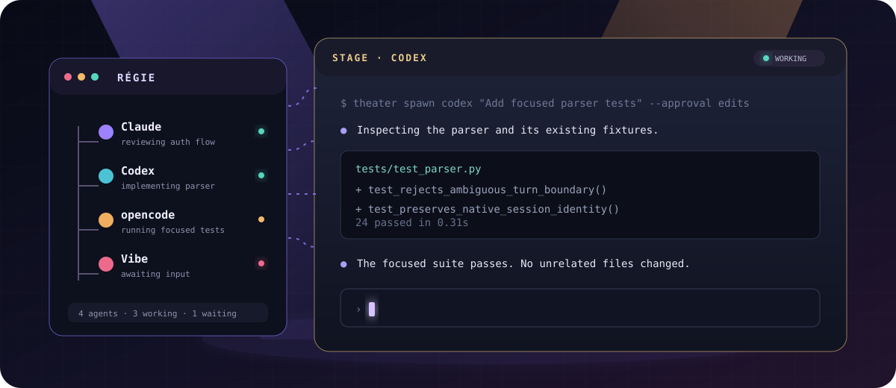
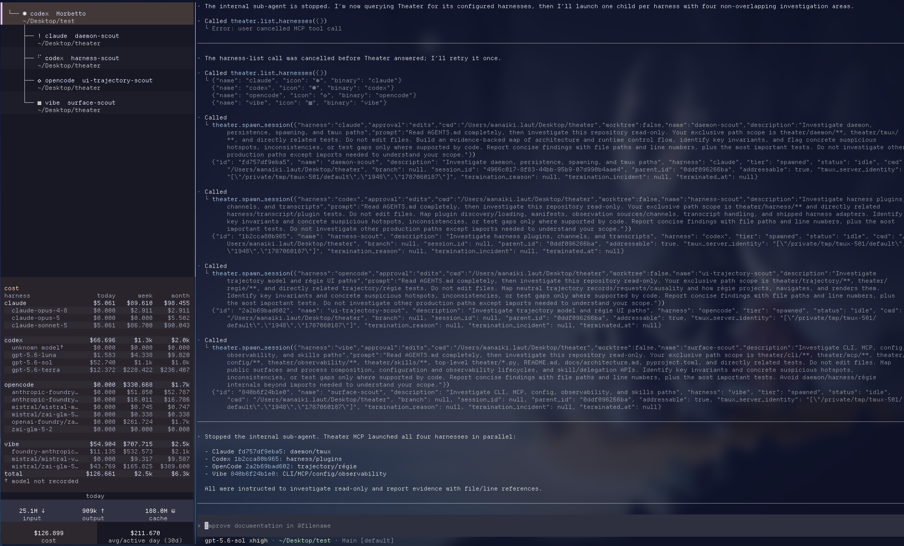
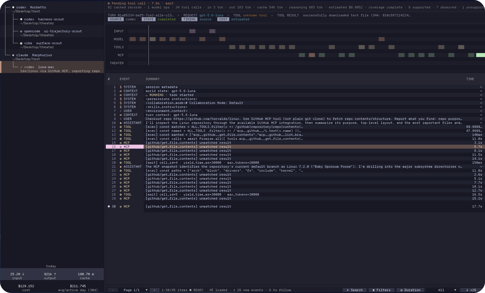
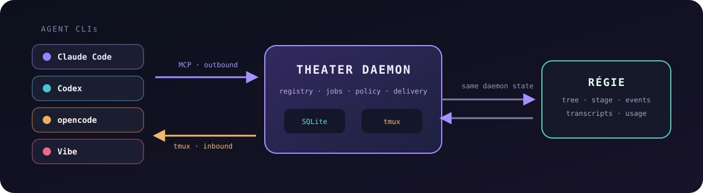

<div align="center">

<h1>🎭 Theater</h1>
<h3>Run the whole show from one terminal.</h3>
<p>
Let orchestrators direct agents across models, harnesses, worktrees, and
projects.<br>
Follow every turn from the régie, step into any session when needed, and keep
the cast, changes, model choices, and costs under control.
</p>
<p>
<a href="https://github.com/mana-byte/theater/actions/workflows/ci.yml"></a>
<a href="https://github.com/mana-byte/theater/releases"></a>
<a href="https://www.python.org/"></a>
<a href="https://github.com/tmux/tmux"></a>
</p>



</div>

Theater is a local-first orchestration layer for coding-agent CLIs. Agents on
one machine can discover one another, spawn children on any harness, and pick
the model and reasoning effort each child needs — you can steer that choice
too, naming the exact model or depth for a given task. Agents delegate work,
exchange prompts, and await results through MCP. The **régie** gives you one
live view of their lineage, status, panes, trajectories, transcripts, and
usage.

No hosted control plane. No replacement chat UI. Your agents keep their native
CLIs, permissions, sessions, and terminal panes.

## 🎬 See it in action

> **Demo video needed (60–90 seconds).** Record a clean 1440p walkthrough that
> opens `theater`, spawns two different harnesses, stages an agent pane, opens
> trajectory detail, interrupts a turn, and resumes a previous session. Hide
> personal paths and tokens. Upload the video as a GitHub asset, save a poster
> frame as `docs/assets/demo-poster.png`, then replace this instruction with a
> linked poster image headed “Watch the demo”.

<table>
<tr>
<td width="50%" valign="top">
<a href="docs/assets/regie-overview.png"></a>
<h3 align="center">One stage for every agent</h3>
<p>Coordinate Claude Code, Codex, opencode, and Vibe from one terminal. Keep agent lineage, live descriptions, native panes, and usage visible.</p>
</td>
<td width="50%" valign="top">
<a href="docs/assets/trajectory-view.png"></a>
<h3 align="center">Understand the work</h3>
<p>Open a live trajectory to see requests, model work, tool calls, timing, cost, and results as they happen—not just the final response.</p>
</td>
</tr>
</table>

## 🎟️ Practical workflows

| Issue / task | Normal (mono-CLI) | Theater |
| --- | --- | --- |
| **🔎 Research across multiple sources** | One agent visits each source sequentially and synthesizes within a single context. | An orchestrator assigns sources to agents in parallel, compares their evidence, resolves contradictions, and acts on the combined findings. |
| **🧩 Resolve multiple Linear issues** | Work through the backlog one issue at a time, or manually coordinate several terminals and branches. | Give the orchestrator a list of issues; it identifies independent work and spawns agents into isolated worktrees to investigate, implement, and test concurrently. |
| **🛡️ Review code changes** | One model reviews the change from one perspective. | Multiple state-of-the-art models review independently, debate disputed findings, and challenge one another to produce a more detailed, better-supported review. |

## ✨ Why Theater

| | |
| --- | --- |
| **Cross-harness delegation** | Claude Code can hand work to Codex, Codex can ask opencode, and every child comes back through the same await/transcript loop. |
| **A real operations view** | See who is working, waiting, idle, or dead; follow lineage; inspect trajectories; and stage any addressable pane. |
| **Parallel work without pretending** | Use isolated Git worktrees or explicit named shared worktrees. Theater tells you where isolation ends. |
| **Safety you choose per spawn** | Every child gets an explicit `manual`, `edits`, or `yolo` approval policy. There is deliberately no global default. |
| **Sessions that survive the task** | Durable descriptions, transcript recovery, recall, resume, and a machine-local event history keep context usable. |
| **Local by construction** | One daemon owns SQLite and tmux. MCP servers and the régie are thin clients; no Theater service receives your code. |

## Install

### Nix

The flake provides Theater with `tmux` and `git`:

```sh
nix profile add github:mana-byte/theater
```

From a clone, `nix develop` opens the complete development environment.

### From source

This path requires [uv](https://docs.astral.sh/uv/) and Git:

```sh
git clone https://github.com/mana-byte/theater.git
cd theater
uv sync --locked
uv run theater --version
```

Use `uv run theater ...` from the checkout, or activate the environment and use
`theater` directly.

## Quick start

Install and authenticate at least one supported CLI, then:

```sh
theater harnesses
theater
```

The bare `theater` command is the normal entry point:

- Outside tmux, it creates or reuses Theater's tmux session and attaches you.
- Inside tmux, it opens the régie in the current session.
- Commands that need the daemon start it on demand.
- Quitting the régie detaches the client; it does not kill the agents or daemon.

Supported harness packages ship for:

| Claude Code | Codex | opencode | Vibe |
| :---: | :---: | :---: | :---: |
| `claude` | `codex` | `opencode` | `vibe` |

## How it works



Theater is three cooperating processes:

1. The **daemon** owns the registry, SQLite state, jobs, and all tmux mutation.
2. Each agent gets a short-lived **MCP server** that forwards requests to the
   daemon.
3. The **régie** is a Textual TUI backed by that same daemon state.

This split follows one hard constraint: MCP has no server-initiated turn. An
agent calls Theater through MCP; Theater reaches an agent through its tmux pane.
No pane means the participant can call out, but cannot be called.

## The régie

The régie is both dashboard and control room. Use it to:

- browse the participant tree and durable task descriptions;
- stage and focus native agent panes without restarting them;
- inspect request, tool, timing, file, transcript, and usage detail;
- resume historical sessions from the command palette;
- watch the live Theater event stream.

Navigation stays terminal-native: `j`/`k` or arrows move through the tree,
`h`/`l` stage trajectories or panes, `H`/`L` stage and focus immediately,
`Enter` toggles the selected surface, and `Ctrl+P` opens the command palette.
Mouse staging, trajectory inspection, and usage expansion are also available.

## Delegate from an agent

Spawned agents receive Theater's MCP server and their participant identity. The
core loop is intentionally small:

```text
whoami → list_participants → spawn_session → await_sessions → read_transcript
```

Agents can also `send` follow-up work, `interrupt_session` without killing a
child, `recall` relevant history, and update their live name or durable task
description. `list_skills` exposes optional orchestration instructions only
when an agent asks for them.

“Done” means a child's turn ended—not that its work is correct. Theater keeps
the transcript and repository separate so callers still inspect both.

## Worktrees and parallel work

```sh
theater spawn codex "Implement the parser" --approval edits --worktree
theater spawn vibe "Document the parser" --approval manual --worktree docs
```

- Bare `--worktree` creates an isolated linked worktree with its own index and
  `HEAD`.
- `--worktree NAME` joins an explicit shared worktree and branch.
- Shared worktrees are collaboration, not isolation: agents must own separate
  files and coordinate Git operations.

## End-to-end example: research to final report

A real project used Theater to turn work history scattered across several
systems into a sourced internship report:

```text
Notion ─┐
Slack ──┤
Linear ─┼─→ evidence reports ─→ reconciled timeline ─┐
GitHub ─┘                                            ├─→ section drafts ─→ integration ─→ agent debate ─→ report.typ
Report criteria ─────────────────────────────────────┘
```

1. **Load the playbooks.** The lead used Theater's `list_skills` and
   `load_skill` tools to load `theater-orchestrate` for ownership, supervision,
   and integration. It later loaded `theater-debate` for the final adversarial
   review.
2. **Gather evidence.** The orchestrator spawned four read-only investigators,
   one each for Notion, Slack, Linear, and GitHub. Each produced a
   source-specific report from its own isolated worktree.
3. **Verify the sources.** The reports recorded dates, concrete activity,
   evidence strength, contradictions, and gaps. Their actual artifacts were
   inspected before the orchestrator accepted them.
4. **Reconstruct the timeline.** A synthesis agent reconciled the reports into
   one chronological dossier, making targeted follow-up queries where sources
   disagreed instead of inventing a convenient narrative.
5. **Load the requirements.** The orchestrator fetched the report structure,
   evaluation criteria, style rules, and confidentiality constraints, then
   mapped the verified timeline onto those requirements.
6. **Draft in parallel.** Agents worked on report sections in isolated
   worktrees. Contributions could overlap: the orchestrator compared them and
   resolved content or Git conflicts during integration.
7. **Assemble and debate.** The orchestrator combined the accepted sections
   into one coherent Typst document, then debated factual, structural, and
   confidentiality findings with an independent agent. They challenged each
   other's evidence and resolved substantiated objections before producing
   `report.typ`.

The human worked primarily with the orchestrator, but never lost access to its
workers: any investigator, author, or debate peer could be inspected, corrected,
interrupted, or opened directly in its native pane. The régie also kept the
model assigned to each task and its cost visible throughout the production.

## Approval and safety

| Mode | Behavior |
| --- | --- |
| `manual` | Keep the harness's normal permission prompts. Best for a pane you are watching. |
| `edits` | Allow edits where the adapter supports it; otherwise fall back conservatively. |
| `yolo` | Use the harness's unattended/approval-skipping mode. Choose it deliberately. |

The daemon is the sole writer of Theater's database and the only process that
creates, destroys, or injects input into participant panes. Human presence is
checked conservatively before delivery. Killing a worktree-backed child can
delete its uncollected work, so Theater makes destructive targeting explicit.

## Useful commands

```sh
theater ls --tree              # participant lineage and state
theater ls --watch             # live status updates
theater bus -f                 # follow the event stream
theater stats --window 24      # recent turn outcomes
theater models                 # allowed models and reasoning levels
theater skills                 # available orchestration skills
theater config                 # resolved machine configuration
theater restart                # apply config without killing agents
```

## Configuration

Configuration is machine-scoped at `$THEATER_HOME/config.toml` (normally
`~/.theater/config.toml`). There is no project-local configuration file.

```sh
mkdir -p ~/.theater
cp config.example.toml ~/.theater/config.toml
theater config
```

A minimal example:

```toml
[theater]
favourite = "claude"

[regie]
theme = "nord"
bus_visible = true
```

The optional `[models]` and `[reasoning]` sections are exact per-harness
allowlists. See [config.example.toml](config.example.toml) for every setting.

<details>
<summary><strong>Adopt a hand-started agent</strong></summary>

Adopt the current tmux pane, then use the returned id in that agent's MCP
configuration:

```sh
theater adopt --harness claude
```

```json
{
  "mcpServers": {
    "theater": {
      "command": "theater",
      "args": ["mcp", "--id", "<participant-id>", "--harness", "claude"]
    }
  }
}
```

Transcript trust is separate from pane adoption. Use `theater candidates ID`
and `theater bind ID CANDIDATE --confirm-id ID` for operator recovery.

</details>

## Extend Theater

### Harness plugins

Add a package at `$THEATER_HOME/harnesses/<name>/manifest.py` exporting one
immutable `MANIFEST`. Local packages can override shipped packages; invalid
packages are rejected with diagnostics instead of partially loading.

Read the [harness plugin guide](docs/harness-plugins.md) before writing an
adapter. A real adapter defines launch behavior, durable observation, turn
boundaries, resume semantics, and optional native signal enrichment.

### Agent skills

Theater ships `theater-orchestrate` and `theater-debate`. User skills live at
`$THEATER_HOME/skills/<name>/SKILL.md` and are data-only: Theater never executes
scripts or Python from a skill package.

## Observability

Human-readable daemon and régie logs are always available under
`$THEATER_HOME/logs/`. Optional OTLP traces, metrics, and structured logs are
off by default:

```sh
uv sync --locked --extra observability
```

```toml
[observability]
otlp_enabled = true
```

Agent log content is excluded unless explicitly enabled. See the complete
settings in [config.example.toml](config.example.toml).

## Development

```sh
uv sync --locked
uv run ruff check
uv run ruff format --check
uv run mypy
uv run pytest --cov
uv run alembic check
```

See [AGENTS.md](AGENTS.md) for invariants and repository conventions.

## Learn more

- [Architecture](docs/architecture.md) — why Theater is shaped this way.
- [Harness plugin guide](docs/harness-plugins.md) — build a new adapter.
- [Configuration reference](config.example.toml) — every supported setting.
- [Acceptance guide](docs/acceptance.md) — verify the real tmux workflow.

<div align="center">

<p><strong>Give every agent a pane. Give every task a stage.</strong></p>

</div>
