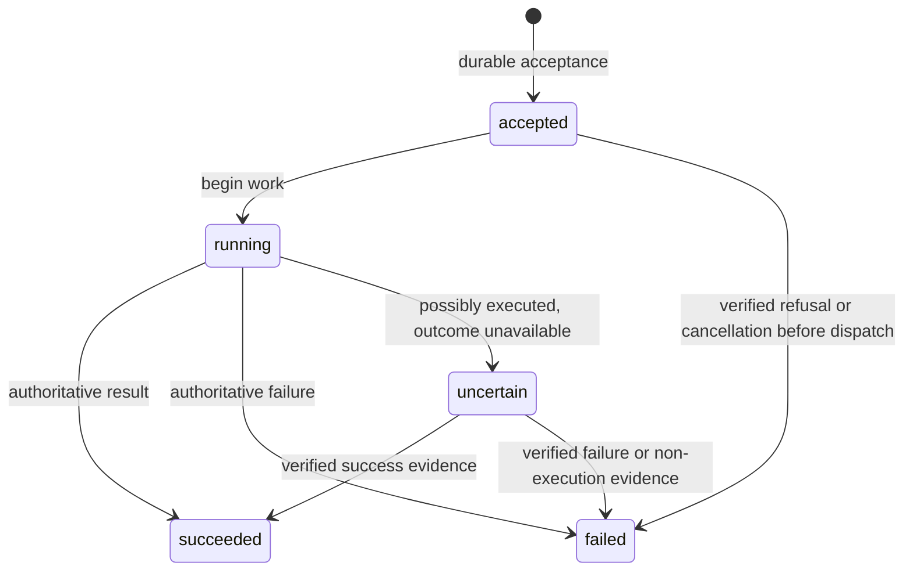

# RC10 implementation specification: headless Theater and independent Régie

## 1. Deliverable and scope

This document specifies the agreed future RC10 implementation work. Its creation is a documentation-only change; it does not implement RC10 or modify Superset.

RC10 will separate Régie from Theater, publish a language-agnostic frontend contract, and make terminal ownership explicit. A future frontend must be able to use Theater without importing its internals.

The release includes:

- A separate, co-versioned `regie` distribution and command.
- A public frontend API, Python SDK, and normative JSON Schemas.
- A terminal-provider contract, implemented by Régie’s persistent tmux bridge.
- Participant identity and control routing independent of tmux-specific addressability.
- Durable operations, orchestration events, provider recovery, and workspace ownership.
- Explicit worktree cleanup.
- A machine-wide scratchpad with configurable expiry.
- Minimal CLI management commands and migration of Régie to the public API.

Superset implementation, an operator MCP adapter, network transport, remote execution, and new terminal-free native harness modes are out of scope. The public API must nevertheless be sufficient to implement a future operator MCP adapter.

The implementation baseline is Theater RC9 at `82986c9bbfcffe4cd198097abe1f73bfa96240e5`.

Sections 1–5 record the release decisions. Sections 6–14 turn those decisions into
an engineering specification: source boundaries, storage, wire contracts, failure
handling, migration, work packages, and verification. All new paths, method names,
and records described there are implementation targets, not existing features.

Engineering reference:

- [6. Source map and package boundaries](#6-source-map-and-package-boundaries)
- [7. Persistent records and transaction boundaries](#7-persistent-records-and-transaction-boundaries)
- [8. Public protocol and method catalog](#8-public-protocol-and-method-catalog)
- [9. Provider lifecycle and terminal execution](#9-provider-lifecycle-and-terminal-execution)
- [10. Operations, authority, and recovery](#10-operations-authority-and-recovery)
- [11. Workspace and scratchpad implementation](#11-workspace-and-scratchpad-implementation)
- [12. Régie extraction and client behavior](#12-régie-extraction-and-client-behavior)
- [13. Migration and implementation work packages](#13-migration-and-implementation-work-packages)
- [14. Verification and release gates](#14-verification-and-release-gates)

## 2. Architecture and public contract

### Process and package boundaries

| Component | Responsibility |
|---|---|
| Theater daemon | Orchestration state, jobs, harness adapters, launch planning, control policy, native runtimes, workspace records, operation recovery, public API |
| Régie TUI | Presentation, navigation, staging, user actions through the public SDK |
| Régie tmux bridge | Persistent terminal-provider connection, tmux execution, terminal inspection, presence and lifecycle reporting |
| Harness adapter | Harness-specific commands, MCP/hook/runtime wiring, control semantics, transcript and lifecycle interpretation |
| Public frontend SDK | Connect-only transport, typed requests/responses, operation waiting, cursor following, provider connection support |

Keep both distributions in the Theater repository. Put the independent Régie project under `packages/regie`, with Python imports rooted at `regie`.

Both packages release as `1.0.0rc10`; Régie depends on that exact Theater distribution version. Their wheel and sdist builds remain separate, and CI verifies version agreement.

Remove Textual from Theater’s runtime dependencies. Régie may import Theater only through `theater.frontend`. Move presentation code and tmux implementation needed by Régie into its distribution; do not expose miscellaneous Theater internals through the SDK to preserve existing imports.

The SDK may resolve the default Unix-socket path, but never starts a daemon or bridge. The `regie` CLI owns startup of the matching installed daemon and its bridge. An already-running daemon is accepted through API-major compatibility and required-capability negotiation; Régie does not automatically replace it.

Preserve current native harness startup topologies. Native control can use a harness runtime without the Régie TUI, but stock CLI terminals still require a terminal provider where the current adapter requires them.

### Terminal providers and harness runtimes

A terminal provider and `RuntimeHost.FRONTEND` are separate concepts:

- A terminal provider owns terminals for multiple participants.
- A frontend-hosted harness runtime connects to one harness session, such as Pi’s existing extension.
- A participant can have both a terminal binding and a native runtime binding.

Reuse the existing frontend transport’s bounded framing, correlation, disconnect handling, and protection against replaying uncertain requests. Generalize shared transport machinery where appropriate; do not turn the per-participant harness runtime into the provider registry.

Theater produces the launch plan: executable, arguments, cwd, environment, participant correlation, approval settings, and installed wiring. The provider executes it and reports the resulting terminal identity.

The provider owns transport mechanics such as paste framing and tmux key delivery. It does not reconstruct harness commands, choose approval settings, or decide that a job completed.

Theater remains the sole writer of orchestration SQLite state. The bridge persists only its own identity, credentials, configuration, and process-management files.

### Participant identity and addressability

Preserve stable participant IDs and historical `parent_id` lineage.

Treat origin as immutable:

- `spawned`: registered through a Theater-coordinated launch.
- `adopted`: first registered through explicit adoption.
- `external`: first discovered through an independently running agent.

An external-origin participant can later become addressable without changing origin.

Add a separate current control-owner reference. Initially it is the spawning parent, or local-operator ownership for a root. An operator can transfer control without rewriting historical parentage.

Represent terminal bindings independently, including:

- Provider ID and provider generation.
- Opaque terminal ID and terminal incarnation.
- Verified occupant identity.
- Relevant local process identity when available.
- Binding health and last accepted lifecycle evidence.

Continue using native runtime bindings and their generations for native control.

Compute addressability from an active delivery route. Keep it distinct from permission, busy state, human presence, and whether a particular action is admissible now. Expose per-operation capabilities and explicit unavailability reasons.

Remove pane requirements from generic control admission. Apply terminal identity checks to terminal routes and native-session checks to native routes. Missing tmux information must no longer imply human absence.

### Wire protocol

Use the existing local Unix socket and NDJSON framing. Require same-UID peers and retain private socket permissions. RC10 adds no network listener.

Every public connection starts with `frontend.handshake`, declaring:

- API major and minor.
- Stable client ID.
- Connection role: `operator` or `provider`.
- Required capabilities.
- Provider identity and credential for a provider connection.

The response supplies the negotiated API version, daemon instance and package versions, capabilities, and protocol limits. Unsupported API majors or missing required capabilities produce structured errors before requests are admitted.

Existing private CLI, MCP, and hook clients retain their current RPC protocol. Classify a connection from its initial frame; public connections cannot invoke private methods.

Ordinary RPC connections allow one in-flight request. A provider uses a separate callback connection on the same socket. That connection supports bounded concurrent reverse requests, with mutations serialized per terminal.

Use separate ordinary connections for long waits and event following so they cannot block interactive controls.

Publish normative JSON Schema Draft 2020-12 schemas for handshakes, requests, responses, callbacks, events, and errors. Expose contract/schema discovery through the public API and include the same schemas in the Theater distribution.

Validate incoming public requests at runtime. Validate actual responses and events against the schemas in CI. The Python SDK tolerates unknown response fields, enum values, and event kinds while preserving their raw representation and cursor information.

### Public API surface

Use curated methods under the `frontend.*` namespace.

| Domain | Public capabilities |
|---|---|
| Contract and diagnostics | Version, capabilities, limits, schemas, health |
| State | Unified snapshot, snapshot paging/release, cursor-based follow |
| Participants | List/get/tree, spawn, adoption, metadata, status hints, termination, control transfer |
| Controls | Capability inspection, send, steer, queued follow-up, interrupt, supported settings |
| Operations | Get and await durable operation status |
| Jobs | List/get and presence-aware await |
| Providers | Registration, inspection, connection/reclaim, capability advertisement |
| Workspaces | Inspection, ownership, usage, guarded cleanup, external deletion coordination |
| Scratchpad | Namespace discovery, get/write/delete |
| Catalogs | Harness availability, models, skills |
| Observation | Transcripts, identity candidates/binding, recall, trajectory |
| Diagnostics | Usage, statistics, existing bus reads |

GC, daemon shutdown, and participant-plugin dispatch remain private.

Public mutations target stable IDs. CLI convenience names may resolve to IDs before submission.

Operator access does not require pretending to be a participant. Preserve optional initiator identity for audit and lineage. Existing participant-scoped private calls continue to enforce their applicable control rules through shared domain services.

The public surface must support an operator MCP adapter entirely through these methods. Implementing that adapter is deferred.

## 3. Lifecycle, persistence, and failure behavior

### Provider selection and bridge lifetime

Add a Theater configuration setting:

```toml
[terminals]
default_provider = "tmux"
```

An explicit spawn override takes precedence; otherwise use the configured default. Do not inherit the parent’s provider or select another connected provider implicitly.

Refuse a spawn when its selected provider is absent or lacks a required capability. Changing the default affects future spawns, never existing bindings.

Add an optional provider override to existing CLI and MCP spawn commands while keeping them on private RPCs.

Régie supplies:

- `regie`: start or connect to the daemon and bridge, then launch the TUI.
- `regie bridge start`: run the provider without the TUI.
- `regie bridge status`.
- `regie bridge stop`.

Stopping the TUI or bridge does not kill participant terminals. No OS login service or service-manager installation is added in RC10.

The bridge pins the tmux server it manages. Provider terminal identities include the server and occupant incarnation, so restarting a server or replacing a pane occupant cannot redirect an old binding.

### Launch and adoption

New frontend roots and Theater-requested children use the same sequence:

1. Validate policy, harness selection, provider selection, and workspace request.
2. Reserve durable participant and operation identities.
3. Reserve workspace usage and create requested Theater-owned worktrees.
4. Build and persist the harness launch plan and correlation facts.
5. Persist dispatch intent before requesting terminal creation.
6. Have the provider create the terminal and return verified identity evidence.
7. Bind the terminal and continue the adapter’s existing native or legacy startup sequence.
8. Resolve the launch operation from verified startup results.

Approval remains mandatory and has no default.

A provider may add its own terminal identity metadata, but cannot override Theater-reserved launch fields. Launch tokens and credentials never appear in general snapshots or event payloads.

Adoption is explicit. Verify the current harness occupant and terminal incarnation before admitting terminal controls. Trusted transcript identity and native control capabilities remain separate gates.

Adoption may create a new participant or explicitly attach a terminal to an existing external participant. Never merge participants automatically by cwd or harness name. Reject contradictory trusted identity evidence.

Adoption does not pretend that missing native extensions, hooks, or MCP wiring were installed into an already-running process.

### Durable operations and idempotency

Return durable operation handles for actions involving provider execution or substantial work, including spawn, send, termination, and workspace cleanup. Return reserved participant or job IDs when applicable.

Small mutations such as metadata and scratchpad writes may return their completed result directly.

Expose operation states:

- `accepted`
- `running`
- `uncertain`
- `succeeded`
- `failed`

An uncertain operation remains reconcilable. Job states stay `running`, `done`, `crashed`, and `killed`; an await timeout is not a job state.

Require idempotency keys for public business mutations. Scope them by stable client ID and compare a canonical method/payload digest:

- Same key and payload returns the original accepted handle or result.
- Same key with a different payload returns `idempotency_conflict`.
- Retain records for at least seven days.
- Pin records while an associated operation remains unsettled.
- Reconnecting a client never creates a second operation for the same retained key.

Reuse the existing control-operation delivery phases and execution barrier. Persist dispatch intent before writing a callback.

A lost acknowledgment is not proof that nothing happened. Never automatically replay an uncertain launch or input operation, move it to another provider, or fall back to tmux. Reconcile through receipts, terminal inventory, and existing native evidence.

Client disconnects stop waiting; they do not undo accepted work.

### Disconnect, reclaim, and human presence

Use these initial provider transport defaults:

| Setting | Default |
|---|---:|
| Heartbeat interval | 10 seconds |
| Lease duration | 30 seconds |
| Concurrent reverse requests | 32 |
| Mutations per terminal | 1 |

Advertise effective limits during handshake. Keep them in named configuration/constants and test with controlled clocks.

A callback connection loss immediately invalidates its control route. Heartbeat expiry handles an unresponsive connection.

Provider loss alone does not declare participants dead, finish running jobs, release workspace usage, or delete resources. Existing observation can still report valid progress or completion. Ordinary await deadlines continue to apply.

A provider reconnects using its durable identity. Fence each connection with a new generation, reject competing live owners, and require terminal reconciliation before restoring controls. Reject stale reports, callbacks, and receipts from previous generations.

Presence protection remains mandatory. The terminal owner supplies focus and occupant evidence and checks them again at mutation time. Unknown presence blocks actions requiring human absence.

A healthy native runtime does not make unknown human presence safe. Report the distinction between a healthy native route and an action blocked by missing presence evidence.

Confirmed terminal or harness exit follows the existing lifecycle policy. Closing the Régie TUI is not a terminal exit.

### Control transfer

Expose an explicit operator operation transferring a specified set of participants to a new control owner.

The transfer:

- Preserves `parent_id`, origin, job authors, and historical lineage.
- Updates current control authority atomically.
- Rejects invalid ownership cycles.
- Lets running and already-dispatched work continue.
- Cancels undispatched follow-ups with an explicit transfer reason.
- Exposes the affected participants and existing job handles to the successor.

Apply the current-owner rule consistently to controls and child metadata operations. Preserve the existing ordinary-send policy separately.

No scratchpad access grants are needed because RC10 scratchpad access is open.

### Workspace ownership and cleanup

Create a durable workspace registry independent of participant retention. Record exact paths and ownership instead of reconstructing ownership from cwd or a branch-name prefix.

Distinguish:

- Theater-owned worktrees.
- Frontend-owned workspaces.
- Borrowed user directories, which Theater must never delete.

Track usage by launch reservations and live participants. These usage records survive provider disconnects; they are not released merely because a heartbeat lease expires.

Frontend deletion coordination must prevent a check/delete race. A successful preparation step marks the workspace as deleting and blocks new usage until the owner confirms completion or cancels. Theater never performs filesystem deletion for a frontend-owned workspace.

For Theater-created worktrees:

- Store the canonical repository root, exact worktree path, branch, and resolved base commit.
- Default both unique and new named worktrees to the initiating checkout’s captured HEAD.
- Place them beneath the canonical repository root.
- Keep named-worktree joining rules; joining never rebases or recreates an existing workspace.
- Preserve current named-branch reuse restrictions after explicit cleanup.

This fixes the existing mismatch between creation beneath a linked checkout and cleanup beneath the main repository.

Participant termination and natural exit retain Theater-owned worktrees and branches. Provide explicit cleanup:

- Refuse while any usage remains.
- Refuse dirty worktrees unless explicitly forced.
- Retain the branch by default.
- Make branch deletion an explicit additional choice, with its own protection against deleting unmerged work.

Allow rollback of resources proven to belong to a failed, never-dispatched launch. Preserve resources whenever process creation or execution is uncertain.

Participant GC must neither delete retained workspace records nor make their ownership undiscoverable.

### Machine-wide scratchpad

Replace tree/repository-scoped scratchpad identity with `(namespace, key)`.

Any trusted local client may read or write it without participant registration or Git repository membership. Participant/client identity is optional audit metadata, not authorization.

Retain existing value-size and namespace quotas, opaque string values, generated-key support, paging, and ordinary last-writer-wins writes. Do not add locking or compare-and-swap semantics in RC10.

Add:

```toml
[scratchpad]
ttl_days = 7
```

Expiry is per entry, measured from its last write. Reads do not extend lifetime. Expired entries are excluded from reads and quota calculations; physical removal is batched.

During the drained upgrade, discard remaining RC9 scratchpad contents. Do not merge old scopes or create recovery grants.

Update existing CLI/MCP scratchpad behavior and documentation without migrating those clients to the public transport.

### Unified state and event journal

Provide a bounded, consistent snapshot containing participant state, capabilities, current control ownership, active operations/jobs, provider state, and workspace usage. Large bodies such as transcripts, scratchpad values, and trajectories remain separately fetched.

Tie the snapshot to an orchestration event cursor. Paged snapshots remain pinned to one logical revision; expiration requires restarting the snapshot.

Persist typed public events for changes to these projections. Cover changes originating from private RPCs, hooks, observers, recovery, and GC—not just public calls.

State changes and corresponding journal records commit atomically. Use a durable monotonic sequence that cannot be reset by retention GC, plus a stream identity distinguishing database replacement.

Use cursor-based bounded long polling:

- Return immediately when events are available.
- Wait when idle.
- Return an empty batch on the wait deadline.
- Require resnapshot on an expired or incompatible cursor.
- Never silently skip a retention gap.

Default event retention to seven days, configurable independently of idempotency retention. Use a default follow wait of 25 seconds with a 30-second maximum.

Keep trajectory as its separate existing snapshot/follow stream. The orchestration journal is not a replacement for trajectory or the diagnostic bus.

## 4. Implementation sequence

### Phase A — Contract and persistence foundations

Define the method catalog, schemas, DTOs, error codes, and capability vocabulary first.

Add Alembic migrations for provider identities, terminal bindings, control ownership, workspaces and usage, public operations/idempotency, and the event journal. Reuse existing runtime and control-operation records rather than duplicating their completion machinery.

Introduce transaction-aware publication of public projection changes. Replace tree-based scratchpad storage and GC with the global expiring store.

Implement the drained-upgrade preflight before schema mutation.

### Phase B — Public API and SDK

Add handshake-based dispatch beside private RPC dispatch. Implement schema discovery, runtime request validation, structured errors, same-UID checks, and connection-role restrictions.

Build `theater.frontend` as the only supported Python import surface for Régie. Implement typed methods, operation waiting, snapshot following, and provider callback handling.

Map public endpoints into shared domain services. Avoid forwarding arbitrary method names to the private RPC registry.

### Phase C — Terminal-provider routing

Generalize physical control admission and observation away from tmux-specific participant fields.

Implement provider registration, leases, fencing, callbacks, launch binding, adoption, presence reporting, and reclaim.

Route terminal creation, delivery, inspection, interruption, and termination through the selected provider. Preserve native runtime routes and their existing evidence requirements.

Update legacy RPC implementations to use the same domain services while retaining existing response shapes where possible. Add the optional provider override and update addressability/origin descriptions.

### Phase D — Workspace and recovery behavior

Implement exact workspace ownership and usage tracking, explicit cleanup, deletion coordination, and the linked-worktree base/path correction.

Implement control transfer and queued-work cancellation.

Ensure daemon restart recovery reconstructs accepted operations, distinguishes unsent work from uncertain dispatch, and never releases workspace usage solely because a provider is offline.

Update stale-job and retention sweeps so they respect recoverable provider-owned work.

### Phase E — Régie extraction and integration

Move Régie into its own distribution. Implement the persistent tmux bridge using the public provider contract.

Migrate all TUI data access and mutations to the public SDK, including trajectories, usage, catalogs, and diagnostics. Replace general-state polling with snapshot plus journal following.

Keep tmux staging in Régie and preserve participant pane identity during presentation changes.

Update the existing UI to show provider availability, unavailable actions, pending operations, and uncertain outcomes. Do not add dedicated provider/workspace dashboards.

Add minimal headless management commands for provider inspection, workspace inspection/cleanup, and control transfer. Keep Theater CLI commands on private RPCs backed by shared services.

### Phase F — Packaging and documentation

Make bare `theater` show help and a migration hint. Make the old UI entry point report that the UI now launches with `regie`; do not retain an implicit launch alias.

Régie reads `$THEATER_HOME/regie/config.toml`. Keep the existing Régie settings names so users can move their `[regie]` block intact.

Theater rejects the old `[regie]` section with an actionable error naming the new file. Do not copy, delete, or rewrite configuration automatically.

Update architecture, CLI/MCP descriptions, harness documentation, and examples to reflect immutable origin, capability-derived addressability, provider ownership, explicit cleanup, and global scratchpad semantics.

Build and validate both distributions from the same release tag. Verify that the Régie package has no private Theater imports and that Theater installs without Textual.

## 5. Verification, migration, and acceptance

### Required contract and integration tests

| Area | Required scenarios |
|---|---|
| Public handshake | Compatible major, incompatible major, missing capability, wrong role, public/private method separation |
| Schemas and SDK | Runtime request rejection; response/event conformance; unknown fields, enums, and event kinds |
| Raw client | Standalone stdlib-only client using the socket without Theater imports |
| Provider portability | A standalone non-tmux test provider exercises callbacks and evidence reporting through the public contract |
| Callback concurrency | Parallel operations on different terminals; serialization within one terminal; spawn waiting without callback deadlock |
| Idempotency | Duplicate request, payload conflict, lost response, daemon restart, unsettled operation retention |
| Launch and adoption | Reserved root, child spawn, explicit adoption, external-origin binding, missing native identity, conflicting evidence |
| Identity fencing | Replaced occupant, reused terminal identifier, stale generation, competing provider |
| Presence | Present, absent, unknown, stale evidence, and a presence change immediately before delivery |
| Recovery | TUI exit, bridge loss, bridge reclaim, daemon restart, uncertain launch/send, no replay or provider failover |
| Control transfer | Lineage preserved, new owner recognized, running work retained, queued follow-ups canceled |
| Workspaces | Borrowed/external ownership, deletion race prevention, disconnected usage retained, linked-checkout paths and base commits |
| Cleanup | Live usage refusal, dirty refusal, explicit force, branch retention, explicit branch deletion |
| Event journal | Snapshot/follow consistency, paging, private-call changes, restart resume, retention gaps, database replacement |
| Scratchpad | Cross-tree access, use outside Git, namespace isolation, last-write expiry, quotas, paging, old-data discard |
| Packaging | Theater without Textual; independent Régie wheel; exact dependency/version agreement; public-import boundary |

Run real tmux integration tests against isolated tmux servers. Include Linux and macOS coverage for identity, presence, socket peer checks, and reconnect behavior.

Retain native runtime regression coverage. Add focused tests showing that provider routing preserves existing Codex, OpenCode, and Pi startup/control behavior without introducing new headless modes.

Complete the repository’s existing Ruff, format-check, mypy, pytest/coverage, fresh Alembic migration, and Alembic schema checks. Extend wheel-install smoke tests to cover both distributions and supported Python versions.

### Upgrade contract

Require a drained RC9 installation. Refuse an upgrade against non-dead participant records or running jobs before applying schema changes. Do not kill sessions or rewrite them as dead to make migration pass.

The migration instructions must explicitly distinguish draining RC9 from RC10’s new worktree-retention behavior: operators must preserve work they need before ending old sessions.

Require manual configuration relocation. Explain that legacy/stock-terminal launches require the Régie bridge and show its standalone startup command.

RC10 must recover its own live sessions and operations after restart; the drained requirement applies to the RC9-to-RC10 transition.

### Completion criteria

The future implementation is complete when:

1. Régie runs from its own distribution and imports only the public frontend namespace.
2. A stdlib-only client and independent test provider can perform orchestration through the documented contract.
3. Terminal routing, identity checks, recovery, and presence protection work without daemon-owned tmux execution.
4. Current native harness behavior remains supported.
5. Ending a participant retains its worktree until explicit cleanup.
6. Scratchpad access is machine-wide with the selected expiry behavior.
7. The release artifacts, migration instructions, and required checks agree with the normative contract.

## 6. Source map and package boundaries

### 6.1 Baseline constraints that determine the refactor

The following are observations from the RC9 implementation. They identify where
changing a DTO or moving the TUI alone would leave the old coupling in place.

| Current source | Existing behavior | Required RC10 change |
|---|---|---|
| [`client.py`](../theater/client.py), [`protocol.py`](../theater/protocol.py) | Private NDJSON client includes daemon startup; the protocol uses integer request IDs and a 64 MiB frame ceiling | Keep private compatibility; implement a separate connect-only public client with negotiated limits |
| [`runtime/socket.py`](../theater/daemon/runtime/socket.py) | Connection loop reads, awaits dispatch, and writes one response; no connection negotiation | Classify the first request, retain connection context, and select an explicit public or private dispatcher |
| [`persistence/database.py`](../theater/daemon/persistence/database.py) | Store construction automatically migrates, then creates a long-lived autocommit connection | Add the upgrade preflight and explicit atomic write units before adding the public journal |
| [`schema.py`](../theater/daemon/schema.py) | Participants contain pane fields; native runtime bindings and control operations already exist | Add terminal bindings and ownership without creating a second native runtime implementation |
| [`spawning/service.py`](../theater/daemon/spawning/service.py) | `reserve` creates state/worktrees; `_launch_pane` calls tmux directly | Persist reservation progress and send a terminal-create callback to the selected provider |
| [`spawning/native.py`](../theater/daemon/spawning/native.py) | Native backend startup still attaches a stock terminal UI | Replace terminal creation at that seam while retaining backend/session startup order |
| [`spawning/frontend.py`](../theater/daemon/spawning/frontend.py) | Authenticated listener belongs to one harness session | Retain it for harness runtimes; do not use it as a multi-terminal provider registry |
| [`harness_runtime/frontend_requests.py`](../theater/daemon/harness_runtime/frontend_requests.py) | Bounded callbacks, 32 pending requests, 64 KiB frames, no uncertain replay | Extract reusable correlation mechanics with caller-specific limits; preserve runtime compatibility |
| [`controls/routing.py`](../theater/daemon/controls/routing.py) | Routes capabilities to native runtime or `legacy_tmux`, including pinned adapter fallbacks | Introduce provider-terminal routing while preserving per-capability adapter decisions |
| [`runtime/control_gates.py`](../theater/daemon/runtime/control_gates.py) | Shared send preflight rejects a participant without a pane; enhanced controls authorize the parent or `cli` | Separate route verification from policy, and use current control ownership |
| [`presence/monitor.py`](../theater/daemon/presence/monitor.py) | Presence inventory and missing-pane behavior are tmux-specific | Consume provider evidence; lack of a terminal/presence source is unknown |
| [`runtime/tmux_reconcile.py`](../theater/daemon/runtime/tmux_reconcile.py) | Server identity changes drive tmux-wide reconciliation | Move tmux inventory into the bridge and reconcile only affected provider bindings |
| [`worktrees/unique.py`](../theater/daemon/worktrees/unique.py) | Removal reconstructs a path and can force-remove worktree and branch | Delete by recorded ownership and exact path only through explicit cleanup |
| [`rpc/scratchpad.py`](../theater/daemon/rpc/scratchpad.py) | Requires participant identity, tree root, and Git repository | Remove scope derivation; share the machine-wide service with public callers |
| [`regie/controllers/polling.py`](../theater/regie/controllers/polling.py) | General state is refreshed through private calls | Maintain a public snapshot projection and follow durable changes |
| [`regie/controllers/staging.py`](../theater/regie/controllers/staging.py), [`session.py`](../theater/regie/controllers/session.py) | Presentation moves and resizes real tmux panes | Keep this behavior in the Régie package, with identity-preserving presentation operations |

The current `protocol.py` prose mentions pipelining and major-version refusal.
The current socket implementation does not implement those guarantees. The new
contract must document executable behavior and test it directly.

### 6.2 Target source layout

Use focused modules rather than adding all provider or public API behavior to
`server.py`, `Store`, or the existing large control service. The following layout
defines responsibility boundaries; split a module further when needed.

```text
theater/
  frontend/                     # only supported Régie import surface
    __init__.py                 # curated exports, no startup side effects
    client.py                   # ordinary operator/provider RPC connections
    provider.py                 # callback reader, writer, handler interface
    transport.py                # NDJSON, bounded reads, socket connections
    errors.py                   # public errors and unknown-error preservation
    capabilities.py             # contract capability names and descriptors
    dto/                        # domain-oriented public value objects
    schemas/                    # normative Draft 2020-12 JSON Schema resources
  daemon/
    frontend/                   # public server boundary, separate from private rpc/
      handshake.py
      router.py
      validation.py
      projection.py             # internal state -> public DTOs
      handlers/                 # thin domain endpoint modules
    terminals/
      registry.py               # provider identities and generations
      connections.py            # active callback peers and heartbeat leases
      bindings.py                # terminal identity verification and attachment
      service.py                # terminal operation coordination
      recovery.py               # inventory/receipt reconciliation
    operations/                 # durable public workflow coordinator
    events/                     # journal, consistent snapshots, cursor following
    persistence/
      transactions.py           # write unit and after-commit notifications
      repositories/             # new records alongside existing repositories
    worktrees/                  # Git operations and workspace domain services
packages/regie/
  pyproject.toml
  src/regie/
    cli.py                      # TUI/bridge commands and startup policy
    config.py                   # standalone Régie config loader
    paths.py                    # Régie-owned files
    bridge/                     # tmux provider process and lifecycle
    tmux/                       # terminal execution and presentation primitives
    controllers/                # extracted TUI controllers
    trajectory/                 # extracted presentation/projection code
    ...                         # other existing Régie presentation packages
  tests/
```

Theater's daemon may depend on the public DTO/schema layer, but the public SDK
must not import the daemon, private client, private configuration loader, tmux,
or Textual. Shared public values belong in `theater.frontend`; presentation
helpers belong in Régie. A facade that simply exports arbitrary private helpers
does not satisfy this boundary.

Keep harness plugin authoring under `theater.harness.contracts`. Native adapters
may continue importing that contract; Régie may not. Convert runtime facts into
public capability and participant DTOs at the server projection boundary.

### 6.3 Authority and physical execution

| Action | Policy/semantic owner | Physical executor | Required evidence |
|---|---|---|---|
| Construct a harness command and wiring | Theater harness adapter and spawner | Theater prepares owned launch files | Validated harness, explicit approval, reserved participant |
| Create a terminal for that command | Theater launch workflow | Selected terminal provider | Provider generation, launch reservation, returned terminal incarnation |
| Send a prompt through a native runtime | Theater control service and adapter | Existing native runtime | Native generation/session and applicable presence gates |
| Deliver legacy input | Theater control service and adapter | Bound terminal provider | Verified occupant, fresh absence, transport capability |
| Interrupt | Theater chooses declared native/terminal route | Runtime or bound provider | Same target identity and control authority checks |
| Change model/reasoning settings | Theater adapter declares support | Native runtime where supported | Existing allowlists and supported setting keys |
| Terminate participant | Theater orchestrates all owned components | Runtime manager and/or provider | Verified backend/process and terminal identity; confirmed outcome |
| Stage, focus, resize, restore panes | Régie presentation | Régie tmux presentation layer | Same pane/server/occupant; no replacement of the participant process |
| Interpret completion | Theater observer/control service | No frontend decision | Existing transcript/native terminal evidence policy |
| Create or delete Theater worktree | Theater workspace service | Git worker invoked by daemon | Explicit recorded ownership, usage and cleanup checks |

Update the corresponding wording in `AGENTS.md` during the future code refactor:
the daemon retains exclusive orchestration authority and SQLite ownership, while
authorized providers execute its terminal requests. The RC9 statement that only
the daemon shells out to tmux is intentionally superseded by this architecture.

## 7. Persistent records and transaction boundaries

### 7.1 Required records

The table below specifies logical records and important fields. Use SQLAlchemy
Core definitions in `schema.py` and Alembic revisions. JSON columns contain
bounded, validated structures; do not serialize arbitrary Python objects.

| Record | Required data | Uniqueness and lifetime |
|---|---|---|
| Participant | Existing ID, immutable origin, lineage, status and identity; `control_owner_kind`, optional `control_owner_id`, `control_revision`, optional `workspace_id` | Existing stable ID; origin is never rewritten by attachment |
| Provider | Opaque ID, unique selector/name, provider kind, credential verifier, configuration/capability version, durable generation counter, created/updated time | Selector such as `tmux` names one registered provider; record outlives connections |
| Terminal binding | Participant ID, provider ID, provider generation, terminal ID, incarnation, process facts, occupant evidence, health and report revision | At most one current terminal binding per participant and one live participant per provider/terminal/incarnation |
| Launch reservation | Operation/participant IDs, selected provider, workspace usage, adapter selection, launch phase, non-secret launch facts, protected artifact references, dispatch marker | Retained while launch or reconciliation is unsettled |
| Public operation | ID, kind, actor, target IDs, state, phase, linked control operation/job, result/error, timestamps, dispatched target identity | One workflow handle; terminal states retained with idempotency result |
| Idempotency record | Stable client ID, key, canonical method/payload digest, operation ID or completed result, retention deadline | Unique `(client_id, key)`; unsettled operations pin the record |
| Workspace | ID, ownership kind/owner, exact path, canonical repository root, branch, resolved base commit, optional name, state, deletion operation/token | Independent of participant GC; active exact paths cannot be multiply owned |
| Workspace usage | Workspace ID, holder kind/ID, acquired time, release time/reason | Unique live reservation/participant usage; handoff cannot create a gap |
| Orchestration journal | Durable sequence, transaction identity, event kind, entity ID, entity revision, bounded payload, recorded time | Sequence never reminted after retention; indexed by sequence and time |
| Global scratchpad | Namespace, key, string value, updated time, expiry time, optional audit actor | Primary key `(namespace, key)`; expiry index supports bounded sweeps |

Continue using `participant_runtime_bindings`, `control_operations`, and
`native_terminal_evidence`. Add a link from a public operation to an existing
control operation instead of running two independent send state machines. Extend
control transport/target facts so terminal dispatch records provider and terminal
generations as rigorously as native dispatch records runtime generations.

`parent_id` and historical job authors are not ownership shortcuts after RC10.
Represent current ownership as either `local_operator` or `participant` plus a
participant ID. All trusted operator clients can act as the local operator;
ownership must not disappear when a particular TUI client exits.

Public callers have a first-class actor representation: stable client ID and an
optional initiating participant ID. Extend job audit storage/projection as needed
so an operator can create a job without a fabricated participant row. Preserve
historical RC9 `caller_id` values rather than reinterpreting their authorship.

### 7.2 Transactions are a prerequisite

`Database.conn` currently runs with `isolation_level="AUTOCOMMIT"`. Appending an
event after an existing repository call would allow a crash between state and
event, violating snapshot/follow consistency. Introduce an explicit write-unit
interface that supplies one transactional connection to every participating
repository.

Required write-unit behavior:

1. Begin a short SQLite write transaction on the daemon event-loop thread.
2. Read and check the relevant stored revision/ownership/idempotency facts.
3. Perform all state changes for that domain transition on that connection.
4. Allocate durable journal sequence values and append projection changes.
5. Commit once.
6. Notify in-memory waiters only after commit. Waiters always re-read storage.

Repository methods participating in the unit must accept its connection. A
nested helper must not silently use the old autocommit connection or independently
commit. Existing `connection=` support in control repositories is a starting seam.

Never hold a database transaction across `await`, terminal callbacks, Git
commands, harness startup, or network-like runtime I/O. Model those as multiple
durable phases with short transactions around the external work. Use worker
threads for Git/process queries, retaining daemon-thread ownership of SQLite.

An exception rolls back both state and journal. After-commit observer failures do
not roll back committed state and cannot erase an event. Recovery must not depend
on an in-memory notification having fired.

Stage in-memory registry/job-cache changes until commit as well. Mutating a shared
`Participant` object before a failed transaction must not leave readers seeing
state that was rolled back. Keep the write-unit result immutable until it is
installed into caches, then wake job/event waiters.

### 7.3 Atomic groups that must be implemented together

| Transition | Records committed together |
|---|---|
| Accept public spawn | Idempotency claim, operation, participant reservation, launch intent and initial workspace usage intent |
| Mark workspace creation ready | Exact workspace result, reservation usage and operation progress |
| Dispatch terminal creation/input | Operation/control delivery phase, exact target generation, execution barrier/dispatch intent |
| Attach verified terminal | Binding, participant projection, reservation progress, capabilities and related events |
| Accept a send | Job, control operation, public operation link and idempotency result |
| Finish a job from evidence | Accepted evidence, job state/result, control/public operation updates where applicable |
| Transfer control | All selected ownership revisions, cancellation of undispatched follow-ups, operation result and events |
| Confirm participant exit | Participant lifecycle, binding state, usage release, job transitions required by existing policy |
| Prepare workspace deletion | Usage check, workspace `deleting` state and deletion token/operation |
| Scratchpad write | Quota check, upsert/expiry, audit metadata and idempotency result |

Provider disconnection is a binding/capability transition. It must not share a
transaction with invented process death or workspace release.

### 7.4 Journal, revisions, and snapshots

Persist stream identity and sequence allocation in `meta`, or use a database
sequence implementation with equivalent non-reuse guarantees. Never initialize a
sequence from `MAX()` over retained events. Stream identity survives ordinary
restart; replacing/restoring the database must invalidate cursors from the other
history. Document database-backup restoration as an explicit stream-epoch reset.

Use entity revisions to reject stale updates in clients and stale mutations in
the daemon. Journal records from one write transaction identify that transaction
and its ending cursor. Clients apply the whole group before advancing their
durable cursor; event paging must not make half a control transfer look complete.

Materialize the bounded active-state snapshot in one consistent database read
transaction, including its ending journal cursor, then release the transaction.
Cache those immutable pages behind an expiring snapshot handle. Do not hold a
SQLite read transaction open while a client slowly requests pages.

The snapshot contains active participants, active operations/jobs, providers,
workspaces and usage. Fetch retained dead/history records through list/get APIs.
Expose lineage IDs even when an ancestor is not in the active snapshot. Use
bounded capability summaries; transcripts, prompts, scratchpad values and
trajectory bodies are not embedded.

Initial public limits, advertised by handshake:

| Limit | RC10 default |
|---|---:|
| Entity page | 200 items, maximum 500 |
| Snapshot handle lifetime | 60 seconds |
| Concurrent snapshots per client | 2 |
| Total cached snapshot bytes | 64 MiB across clients |
| Event follow wait | 25 seconds, maximum 30 |
| Event retention | 7 days |

Byte ceilings also apply; item counts alone are insufficient. If the active
projection cannot fit the advertised snapshot budget, return a structured limit
error, never a silently incomplete snapshot. Free cached pages on release/expiry.
Snapshot handles need not survive daemon restart; journal cursors do.

Include public projection changes from registry methods, hooks, observer status
changes, native recovery, private RPCs, metadata updates, and GC tombstones.
Do not implement the journal only in public endpoint wrappers or subscribe to
the diagnostic bus and assume it is transactionally complete.

### 7.5 Event catalog and client application

Publish domain changes with stable typed names. Use bounded public projections
for upserts and stable IDs/revisions for removals. Never put full prompts, launch
environments, transcript bodies or scratchpad values into this journal.

| Event kind | Projection change |
|---|---|
| `participant.updated`, `participant.removed` | Participant lifecycle/metadata/identity projection or GC tombstone |
| `participant.controls_changed` | Route/capability/admission/presence summary changed |
| `participant.owner_changed` | Current owner and ownership revision changed |
| `provider.updated` | Provider availability, generation or capability set changed |
| `terminal.binding_changed` | Attachment, verified identity, health or detachment changed |
| `operation.updated` | Durable operation state, phase or result changed |
| `job.updated`, `job.removed` | Job progress/result or retained-history GC tombstone |
| `workspace.updated` | Workspace state/ownership or deletion outcome changed |
| `workspace.usage_changed` | Reservation/participant usage acquired, handed off or released |
| `catalog.invalidated` | Relevant harness/provider availability catalog requires a bounded refetch |

Include transaction ID, ending transaction cursor and entity revision in each
group. `state.follow` returns complete bounded transaction groups and the cursor
through the last complete group. A client disconnected mid-frame cannot advance
past a partial transaction. Duplicate events may be ignored by revision; gaps
must trigger resnapshot rather than guessed state.

Journal meaningful projection changes, not every unchanged heartbeat or repeated
presence poll. Callback/report sequence numbers are separate from public entity
revisions and the journal cursor. Publish provider loss and recovered bindings;
ordinary heartbeat renewal can remain ephemeral until visible health changes.

The service must close the lost-wakeup race: read events, register/check the
notification revision, and recheck storage before sleeping. Always re-read on
wakeup/deadline. It must still work after an after-commit notification is lost.

## 8. Public protocol and method catalog

### 8.1 Connection state machine

RC10 introduces public API version `1.0`. This is distinct from the existing
private `PROTOCOL_VERSION` and from package version `1.0.0rc10`.

```text
accepted Unix socket
  -> verify local peer UID
  -> read bounded first frame
      -> frontend.handshake -> validate/agree role and API -> public connection
      -> known private method -> existing private connection
      -> other frontend.* method -> handshake_required
      -> malformed/unknown frame -> structured error or close if unframeable
```

Connection classification is permanent. A public connection cannot switch to
private methods, and a private connection cannot later enter the public namespace
without reconnecting. Provider callbacks use the same socket path but a different
connection with an explicit callback channel selected during handshake.

Same-UID verification must use the platform peer-credential mechanism, with
Linux and macOS implementations tested separately. A client-supplied UID is not
evidence. Fail the connection if required peer identity cannot be established.
Private client compatibility does not exempt the socket from local peer checks.

Use API-major equality. Minor versions identify additive contract revisions;
select a mutually supported minor and require declared capabilities explicitly.
Unknown optional response data is allowed; an unknown required capability is a
handshake failure. Do not infer capabilities from package version strings.

### 8.2 Ordinary request and response envelopes

Keep the familiar private envelope shape, with additional public schema rules.
`id` is a positive JSON integer within the interoperable exact-integer range;
`method` is a catalog entry; `params` is an object. Public business mutations add
top-level `idempotency_key`. `_meta` may carry trace metadata and is not authority.

Example operator handshake:

```json
{"id":1,"method":"frontend.handshake","params":{"api":{"major":1,"minor":0},"client_id":"regie-local-a","role":"operator","channel":"rpc","required_capabilities":["orchestration.v1","state.follow.v1"]}}
```

Example response, showing the minimum shape rather than every advertised limit:

```json
{"id":1,"ok":true,"result":{"api":{"major":1,"minor":0},"daemon_instance_id":"daemon-a","package_version":"1.0.0rc10","capabilities":["orchestration.v1","state.follow.v1","terminal-provider.v1"],"limits":{"max_frame_bytes":67108864,"max_in_flight":1,"follow_wait_max_seconds":30}}}
```

Example durable mutation:

```json
{"id":2,"method":"frontend.controls.send","idempotency_key":"send-a-0007","params":{"participant_id":"participant-a","prompt":"Review the latest changes."}}
```

```json
{"id":2,"ok":true,"result":{"operation_id":"operation-a","state":"accepted","participant_id":"participant-a","job_handle":"job-a"}}
```

Example refusal:

```json
{"id":2,"ok":false,"error":{"code":"provider_unavailable","message":"The selected provider tmux is offline. Start regie bridge start and retry with a new request after checking the existing operation.","details":{"provider_id":"provider-a","reason":"disconnected"}}}
```

The example error applies before operation acceptance. Once a mutation is
accepted, later failure belongs to its operation record, even if the original
client has disconnected. A duplicate request for an accepted mutation returns
the original handle, including when that operation later failed.

Require strict JSON: reject non-finite numbers, malformed Unicode/framing, invalid
field types, and unknown request fields except documented extension objects.
Do not coerce booleans to IDs/numbers. Errors preserve machine-readable codes,
bounded details and actionable prose. Unknown error codes remain representable
in the SDK.

Retain a 64 MiB absolute frame ceiling, including the serialized envelope and
newline. Use smaller byte budgets for ordinary paged responses. Publish provider
input/screen bounds separately and admit only payloads fitting both the public
frame and the selected provider's limits. Do not silently truncate a prompt or
assume the existing harness callback's 64 KiB bound fits terminal-provider input.

### 8.3 Idempotency processing order

1. Authenticate the connection, validate the method schema and key format.
2. Canonicalize the method and validated request payload using RFC 8785, reusing
   the existing dependency. Exclude request ID, trace metadata and the key itself.
3. Look up `(client_id, idempotency_key)` before resolving mutable defaults or
   performing current-state admission checks.
4. On a matching digest, return the saved result/handle. On a mismatch, return
   `idempotency_conflict` without side effects.
5. For a new key, perform admission and atomically claim it with the accepted
   operation or completed synchronous mutation.

Capture resolved default provider, initiating HEAD, approval and adapter choices
in the accepted operation. A retry must not re-resolve them against changed
configuration. Concurrent requests on different connections with the same key
must converge through the database uniqueness constraint.

Only accepted/completed business mutations claim a key. Malformed requests and
pre-admission refusals have no operation. SDK retry logic distinguishes these
cases from a response lost after submission. Handshake, heartbeat, state reads
and provider evidence reporting use their own correlation/revision semantics;
they do not create seven-day business idempotency rows.

Retain synchronous results and settled-operation idempotency records for at
least seven days from settlement. Unsettled operations are retained regardless
of age. After a settled record's retention expires, the API does not promise
deduplication for that key; document this in the raw-client guide.

### 8.4 Required endpoint catalog

Every name below is relative to `frontend.`. `read` means one ordinary response;
`write` means an idempotent synchronous mutation; `operation` returns a durable
handle; `provider report` is limited to the authenticated provider's generation.

| Method(s) | Class | Required input/output semantics | Existing implementation to reuse |
|---|---|---|---|
| `handshake`, `contract.get`, `schemas.get`, `health.get` | read/bootstrap | Versions, roles, capabilities, method/schema IDs, limits, health | New public boundary; selected `ping` facts |
| `state.snapshot`, `state.page`, `state.release`, `state.follow` | read/resource lifecycle | Immutable page handle, ending cursor, typed transaction groups, explicit resnapshot errors | New journal/snapshot service |
| `participants.list`, `participants.get`, `participants.tree` | read | Stable IDs, filters, bounded pages; tree retains lineage independently of ownership | Participant repository/registry |
| `participants.spawn` | operation | Harness, prompt/cwd, explicit approval, optional provider/workspace/model/reasoning/resume/name/description/initiator | Spawner and existing rails |
| `participants.adopt` | operation | Provider, terminal ID/incarnation, inspected evidence, optional existing participant ID | Registry/adoption and transcript identity gates |
| `participants.update` | write | Stable target; name/description patch with omitted versus cleared semantics | Participant metadata service extracted from private handlers |
| `participants.status` | write | Existing allowed status hints and actor rules; no manufactured process/native lifecycle | Existing status handler policy |
| `participants.terminate` | operation | Stable target, current authority, verified termination result | Kill/runtime teardown service |
| `participants.transfer_control` | write | Explicit bounded ID set, expected ownership revisions, new owner | New ownership service, existing queue cancellation |
| `controls.get` | read | Route/capability matrix, current admissibility and reasons | Control route resolver and gates |
| `controls.send`, `controls.steer`, `controls.queue_followup` | operation | Target, prompt and existing response-format semantics; return operation/job | Existing control service |
| `controls.interrupt`, `controls.settings.update` | operation | Target; supported model/reasoning changes only for settings | Existing interrupt/settings policy |
| `operations.list`, `operations.get`, `operations.await` | read | Filter unsettled operations; bounded wait returns current state and `timed_out` | New workflow repository |
| `operations.reconcile` | operation reference | Trigger safe evidence refresh for the existing operation; return the same handle | Reconciliation service; never an instruction to resend |
| `jobs.list`, `jobs.get`, `jobs.await` | read | Existing job results and presence-aware wait semantics; bounded pages/waits | Job manager and awaiting service |
| `providers.register`, `providers.update` | write/operator | Durable identity/selector provisioning, capabilities and supported limits | New provider registry |
| `providers.list`, `providers.get` | read | Identity, kind, generation, health, effective capabilities, last report | New provider projection |
| `providers.heartbeat`, `providers.report` | provider report | Current generation, monotonic report sequence, bounded identity/lifecycle/presence facts | New provider connection service |
| `providers.terminals.list`, `providers.terminals.inspect` | read | Bounded cached/refreshed inventory for explicit adoption/diagnosis | Provider inventory callbacks; replaces unmanaged-pane discovery |
| `workspaces.register` | write | Frontend-owned or borrowed existing path; owner and exact repository facts | New workspace registry |
| `workspaces.list`, `workspaces.get` | read | Ownership, exact path/base/branch, usages, deletion state | Workspace repository |
| `workspaces.cleanup` | operation | Theater-owned ID, explicit force/branch flags, structured partial result | Refactored Git worktree removal |
| `workspaces.prepare_delete`, `workspaces.confirm_delete`, `workspaces.cancel_delete` | write | External-owner deletion fence/token; confirmation or cancellation | New deletion coordination |
| `scratchpad.namespaces`, `scratchpad.get` | read | Machine-wide namespace/key pages excluding expired entries | Refactored scratchpad repository |
| `scratchpad.write`, `scratchpad.delete` | write | String values/generated keys; bounded key deletion or namespace clear | Shared scratchpad service |
| `catalogs.harnesses`, `catalogs.models`, `skills.list`, `skills.load` | read | Catalog, diagnostics, provider-dependent launch availability, skill content | Current harness/model/skill services |
| `transcripts.read`, `transcripts.candidates` | read | Bounded existing transcript cursors and trusted-identity candidates | Transcript pager/identity service |
| `transcripts.bind` | write | Explicit operator binding with existing provenance/collision gates | Current transcript binding service |
| `recall.query`, `recall.read` | read | Current bounded recall/history semantics | Existing recall services |
| `trajectory.snapshot`, `trajectory.follow`, `trajectory.close`, `trajectory.locate`, `trajectory.search` | read/resource lifecycle | Existing independent trajectory cursors and resync behavior | Existing trajectory service |
| `usage.totals`, `usage.summary`, `usage.by_harness`, `stats.get`, `bus.tail` | read | Existing bounded diagnostics and usage data | Existing usage/statistics/bus services |

Snapshot release and trajectory close dispose read resources; they do not need
durable mutation idempotency. Reconciliation schedules evidence reads against an
existing operation and is naturally repeatable. All other writes in the table
must define their idempotency schema explicitly.

Operator-role connections can call operator APIs. Provider-role ordinary
connections can report their own inventory/presence/receipts and read the
contract; they cannot use their provider credential to mutate arbitrary
participants. A trusted frontend needing operator access opens an operator
connection. This is connection discipline among trusted local clients, not a
sandbox against another process owned by the same user.

Do not expose arbitrary `rpc.call`, `plugin.call`, shutdown, or GC forwarding.
Do not export Python adapter class names or private objects in the contract.

### 8.5 DTOs and capability reporting

Define separate DTO families for participants, terminal bindings, native runtime
summaries, controls, operations, jobs, providers, workspaces, catalogs, and events.
Projection functions translate internal enums and records into stable public
spellings. The SDK keeps unknown values as strings/raw objects.

A participant projection includes stable ID, immutable origin, optional live
name, description, harness, cwd/workspace, lineage, current owner/revision,
lifecycle status, trusted identity summary, native and terminal route summaries,
presence, addressability, and per-action capability/admission reasons. Do not
include credentials, full launch environments or private native endpoints.

For each action distinguish:

- `supported`: the harness/provider can implement the operation.
- `route_available`: a verified live delivery route exists.
- `admissible`: current policy, presence, identity and busy gates allow it.
- `reason`: a stable code plus explanatory detail when unavailable or blocked.

These are current observations, not a guarantee that a later mutation will pass.
Recheck on admission. An external-origin participant can have a healthy terminal
route; a spawned participant can have none. A present human can block an otherwise
addressable participant.

Preserve existing error codes where their meaning still applies. Add explicit
codes for `handshake_required`, `incompatible_api`, `missing_capability`,
`wrong_connection_role`, `idempotency_conflict`, `provider_unavailable`,
`provider_busy`, `stale_generation`, `terminal_identity_mismatch`,
`ownership_conflict`, `workspace_in_use`, `workspace_deleting`,
`snapshot_expired`, and `resnapshot_required`. Unknown presence should retain the
existing protected-action error family with `presence.state="unknown"` detail.

Harness catalog entries separately report installation/compatibility, supported
wiring, whether the selected startup topology needs a terminal, selected provider
readiness and effective launch availability. An installed legacy harness with an
offline provider is installed but unavailable for launch. An existing native
runtime retains its native capability facts when a provider disconnects, while
presence can still block protected actions. Do not collapse these cases into a
single `available` boolean with no reason.

### 8.6 Schema and SDK conformance

Store a versioned schema catalog with stable `$id` values and local `$ref`
resolution. Ship all referenced resources inside the wheel/sdist; offline clients
must not fetch schemas from a network. Use a Draft 2020-12 validator such as
`jsonschema` as an explicit daemon dependency during implementation.

Validate complete request envelopes and domain params before executing a handler.
CI must validate actual handler responses, provider callback frames and journal
events, not only hand-written examples. Bound error details as well as success
payloads. Keep schema IDs and catalog capability declarations synchronized.

The public Python SDK should expose domain methods and public values, not a
generic passthrough to private method names. Its connection pool separates
interactive calls, operation waits, state following and provider callbacks.
Cancellation of a waiter closes/releases its connection without cancelling
accepted daemon work. No SDK import or constructor starts processes.

## 9. Provider lifecycle and terminal execution

### 9.1 Registration, selectors, and credentials

Use a durable provider ID plus a unique human-readable selector. The default
selector `tmux` resolves to the Régie bridge registered for this Theater home.
An explicit provider override can name an exact ID or selector; resolve it once
at acceptance and persist the ID. Multiple providers may coexist under distinct
selectors. Connecting another one never changes an existing binding.

Provisioning is an operator mutation. The bridge generates and privately stores
its random credential before submitting registration; the daemon stores a
verifier, following the existing participant-plugin credential pattern. Return
provider ID and registration facts without echoing the credential. Retrying a
lost registration response uses the same client/key and locally retained token.
An existing selector cannot be silently taken over by a fresh identity.

Keep bridge identity/credential, lock/PID and logs under Régie-owned paths. File
permissions follow the current private-home conventions. Logs, snapshots,
exception details and general events must redact credentials and launch tokens.
The daemon remains the authority for provider participants and operations.

### 9.2 Connections and generations

A bridge normally has an operator/bootstrap connection when needed, a provider
RPC connection for heartbeats/reports, and a provider callback connection. Both
provider connections authenticate the durable provider ID and credential.

Opening an accepted callback connection acquires a new durable provider
generation. A competing live connection for that provider is refused; a
disconnected or expired generation can be replaced. Ordinary report connections
refer to the acquired generation and never allocate one themselves.

The provider is `reconciling` until its current inventory has been verified.
Restore individual terminal routes only after matching ID, incarnation and
occupant. Heartbeats extend the 30-second lease; they do not verify terminals.
Disconnect invalidates control immediately without waiting for the heartbeat
deadline. Use monotonic clocks for in-process deadlines; persisted timestamps
remain audit/recovery data, never reusable process-local lease deadlines.

Do not trust a persisted `online` flag after daemon restart. Every provider
starts offline/reconciling until its new connection completes this protocol.
Provider-generation changes do not themselves change participant origin or
terminal incarnation.

### 9.3 Callback methods and framing

Use the existing runtime callback shape as the model: string correlation IDs,
`type="request"`/`"response"`, and exactly one result or error. The terminal
provider channel is versioned separately from per-harness frontend connections.

Required reverse methods:

| Callback | Semantics |
|---|---|
| `terminal.create` | Execute the exact launch specification once; return terminal/incarnation and process/occupant evidence |
| `terminal.inventory` | Bounded page of terminals and identity markers; explicitly indicate inventory completeness |
| `terminal.inspect` | Refresh occupant, process, focus/presence, mode and bounded screen evidence for one incarnation |
| `terminal.deliver` | Apply the adapter-selected input action with identity/presence revalidation at execution |
| `terminal.interrupt` | Execute the declared terminal interrupt action after the same gates |
| `terminal.terminate` | Close the verified terminal/process target and report observed exit or unresolved outcome |

Example callback:

```json
{"type":"request","id":"callback-a","method":"terminal.deliver","params":{"operation_id":"operation-a","provider_generation":4,"participant_id":"participant-a","terminal_id":"terminal-a","terminal_incarnation":"incarnation-a","expected_occupant":"occupant-a","action":{"kind":"submit_text","text":"Review the latest changes."},"require_absent":true}}
```

```json
{"type":"response","id":"callback-a","result":{"operation_id":"operation-a","provider_generation":4,"terminal_id":"terminal-a","terminal_incarnation":"incarnation-a","delivery":"accepted","presence_revision":19}}
```

The provider returns `accepted` only when the requested transport action was
applied. It does not mean the harness processed the input, finished a turn, or
completed the Theater job. A refusal before touching the terminal can return
`rejected` with evidence. Partial application or loss of certainty returns
`unknown`, never an apparently safe retry instruction.

For mutation callbacks include operation ID, exact target identity and generation.
For terminal creation include the reserved participant/launch identity instead
of an existing terminal ID. Report timestamps are descriptive; monotonically
increasing report revisions and generation fences determine ordering.

Serialize writes to each connection. Permit 32 pending callbacks across terminals
and one mutation per terminal. Keep a reader running while handlers wait; the
provider must not need the blocked spawn RPC connection to answer its callback.
Bound pending queues and return saturation before dispatch when capacity is full.

Before starting any queued side effect, the provider rechecks that the callback
connection/generation is still active and its local lease has not expired. Drop
undispatched work from a lost generation; do not let an old coroutine deliver
after reconnection. Once a physical side effect has begun, disconnection cannot
undo it: retain uncertainty and reconcile instead of promising cancellation.
The tmux bridge's process lock and terminal execution locks apply across reconnects.

Initial transport deadlines are 10 seconds for handshake, 30 seconds for an
individual callback, and the existing adapter-specific budget for complete
harness startup. A callback timeout does not cancel work already executing in
the provider. Read-only inspection may retry; mutating callbacks follow the
uncertainty rules in section 10. Keep deadlines named and testable.

### 9.4 Launch specification and correlation

`terminal.create` carries an executable/argv vector, exact cwd, complete planned
environment additions, launch/participant IDs, and bounded presentation hints.
Never pass an untrusted shell command assembled by the frontend. The provider
may use its transport's necessary quoting/exec mechanism but must preserve argv
and environment semantics. Theater's adapter owns any deliberate shell usage.

Theater prepares MCP, hooks, receipt channels, OTel and runtime wiring before
terminal dispatch, retaining the existing artifact ownership rules. The provider
can add transport metadata such as its terminal ID, but reserved Theater identity
and correlation fields cannot be overwritten.

The launch reservation exists before an MCP `hello` or hook can race back from
the child. Correlate that arrival with the reserved participant using protected
launch facts. Do not create a second external participant because the terminal
creation acknowledgment is still pending. Native session ID may arrive later;
terminal identity, process identity and native/transcript identity are distinct.

For a detached backend, retain Theater's runtime-manager ownership and existing
generation verification. When the adapter reaches the stock UI attachment step,
ask the selected provider to create that UI terminal. For a frontend-hosted
runtime, start the per-participant listener/wiring before launching the CLI.

Current adapter-controlled native-to-legacy fallback remains valid only where
existing evidence proves the earlier attempt did not execute work and teardown
is verified. It may not select a different provider, bypass a disconnected
provider, or replay uncertain terminal creation/input.

### 9.5 Adoption and identity verification

Adoption is a two-stage inspect-and-attach workflow. Discovery lists candidates;
the operator explicitly selects a terminal incarnation and optionally an existing
participant. The daemon then requests a fresh inspection before committing the
attachment. Cached screen text or matching cwd is insufficient.

Verify provider ownership, incarnation, the live harness occupant, process
identity when available, and consistency with any trusted session/transcript
identity. Reject a terminal already bound to another live participant. Reject an
existing participant whose verified identity contradicts the candidate. A root
created this way has origin `adopted`; an existing external participant remains
`external`.

After successful terminal verification, enable only terminal capabilities that
the harness and provider actually support. Keep missing native extension,
transcript provenance, resume and session-binding gates visible separately.
Adoption installs no missing wiring into the running process.

### 9.6 Presence and evidence

Reuse the public meaning of `PresenceState` and revision-based wait behavior from
`daemon/presence/contracts.py`. Move tmux focus inventory, wake hooks and mode
inspection into the bridge. The daemon's presence service aggregates verified
provider evidence and exposes the same fail-closed contract to controls/awaits.

The bridge refreshes focus/occupant immediately before terminal mutation while
holding that terminal's execution lock. If focus became present/unknown or the
occupant changed, refuse without delivery and report the new revision. Copy mode
continues to block unsafe legacy key injection rather than all native controls.

For native delivery, refresh applicable terminal presence through the provider
before invoking the runtime. This retains the existing asynchronous-observation
limit: focus may change after a check. Do not claim an atomic lock over a human's
input and the separate native runtime. Missing or failed refresh is unknown and
blocks protected actions.

Inventory/report absence is not process-exit proof unless the provider has
completed the relevant inventory and supplies authoritative identity/lifecycle
evidence. Report loss, an incomplete page and a provider timeout never prove an
exit. The adapter/daemon continues interpreting harness completion.

### 9.7 Régie bridge lifecycle

`regie bridge start` is idempotent under a private process lock. It starts a
background process, waits for readiness/registration, and reports failure if it
cannot acquire the expected provider. `regie bridge status` is read-only and
reports process state plus daemon connection/reconciliation state.

Pin the tmux server by exact identity and record terminal incarnation markers
with terminal-owned metadata sufficient to correlate a lost create response.
Pane ID reuse or a replacement tmux server cannot satisfy an old binding. Normal
pane movement for staging retains identity and does not create a new participant.

`regie bridge stop` stops provider reporting/callback service and releases its
process lock; it does not kill terminals or workspaces. `regie` TUI exit leaves the
bridge running. On daemon unavailability, the bridge retains its server identity,
reconnects with bounded backoff, and reconciles rather than executing queued
mutations from the old connection. No OS service registration is installed.

The bridge need not invent durable proof for a legacy input action whose receipt
was lost. If terminal metadata cannot prove application, the daemon keeps that
operation uncertain. Durable provider identity is not a promise of exactly-once
input execution across crashes.

## 10. Operations, authority, and recovery

### 10.1 Operation success and job completion are different

An operation tracks execution of a requested action. A job tracks the agent work
that follows. The UI and public schema must keep these separate.

| Action | Operation succeeds when | Job behavior |
|---|---|---|
| Spawn | Required process/terminal/native identity is verified and the existing adapter startup sequence, including required initial delivery, is accepted | Spawn job continues until the existing completion policy resolves it |
| Send/steer | Chosen route acknowledges application under its existing receipt semantics | Related agent job can still be running or later fail |
| Queue follow-up | Follow-up is eventually dispatched and acknowledged | Enqueue returns an accepted handle immediately; job remains running while queued |
| Interrupt | Adapter/provider confirms the requested interrupt action according to its contract | Job termination follows actual evidence; transport acknowledgment alone cannot fabricate it |
| Settings update | Supported setting application is confirmed by the runtime contract | Usually no new agent-work job |
| Terminate | All required owned process/runtime/terminal components are verified stopped | Jobs settle through existing termination policy |
| Workspace cleanup | Requested worktree removal and optional branch action have verified outcomes | No agent-work job |

An operation that has already succeeded at delivery is not later rewritten as
failed because the agent job crashed. Expose links so clients can wait for the
appropriate result. Preserve structured results, result provenance and partial
result completeness in job DTOs.

### 10.2 State transitions and dispatch barrier



Maintain the existing detailed delivery phases beneath this public projection.
`uncertain` is unsettled, not terminal failure. An await deadline returns the
current operation and `timed_out=true`; it does not change either state machine.

The dispatch marker is committed before writing a callback. A crash immediately
after that commit can leave an operation uncertain even if the bytes never
reached the provider. This conservative ambiguity is intentional. Persistence
and a Unix socket do not form one atomic transaction.

While an uncertain prompt could still be executing, retain the existing
execution barrier for that participant/route. Do not dispatch a queued follow-up
merely because the provider reconnected. Release the barrier only using the
existing trusted receipt/native-idle/terminal evidence rules adapted to the
bound transport. An operator requesting reconciliation does not bypass them.

### 10.3 Crash-point recovery matrix

| Last durable fact | Recovery action | Prohibited shortcut |
|---|---|---|
| Request never accepted | Client can submit it normally | Claiming an operation exists only in memory |
| Accepted reservation, no external work intent | Resume validation/preparation from saved inputs, or fail explicitly | Re-resolving provider/default HEAD silently |
| Workspace create intent, no recorded result | Inspect exact path/branch and Git records; preserve ambiguous resources | Deleting any directory sharing a branch-name prefix |
| Backend launch intent without verified PID/start identity | Use existing native recovery refusal/preservation behavior | Guessing a backend by cwd and signalling it |
| Terminal-create dispatch marker, no acknowledgment | Reconcile provider inventory using launch identity; remain uncertain if unproven | Creating a second terminal automatically |
| Verified terminal bound, native session not ready | Continue existing exact-session startup/recovery gates | Inventing session identity from terminal text/cwd |
| Input dispatch marker, receipt missing | Inspect current-generation reports and native/terminal evidence | Sending the prompt again or switching to another transport |
| Receipt/evidence persisted, operation result not settled | Apply deterministic settlement in one transaction | Re-executing the action to obtain a fresh response |
| Operation succeeded, client response lost | Return stored handle/result for same key | Minting a new participant/job |
| Provider offline with live participants | Mark terminal routes unavailable, retain work/resources and wait for evidence | Declaring all jobs crashed on lease expiry |
| Termination sent, exit not confirmed | Keep termination operation uncertain and workspace usage held | Reporting kill success or cleaning a possibly used worktree |
| Workspace directory removed, branch step failed | Report structured partial outcome and preserve the registry record | Claiming the entire cleanup succeeded |

Automatic recovery may continue a step proven never dispatched. It may retry
read-only inspection. It must not automatically retry a possibly executed
mutating step, including terminal creation. Keep accepted work owned by daemon
tasks; request-handler cancellation only detaches the caller's wait.

### 10.4 Daemon restart order

1. Acquire the existing daemon lock and run the applicable migration/preflight.
2. Open storage, restore durable sequence/stream identity and operation records.
3. Load participants, control ownership, workspace records and held usages.
4. Mark provider-backed routes unavailable until connections reconcile.
5. Restore existing authenticated harness frontend listeners and native runtime
   recovery, preserving their compatibility/generation checks.
6. Restore job/control evidence and execution barriers before allowing new input.
7. Begin accepting provider connections and verify their terminal inventories.
8. Settle proven outcomes, then resume only undispatched admissible work.
9. Start normal observation and bounded maintenance without expiring recoverable
   operations or held workspace usage.

Initial recovery state must be observable in the public snapshot. Connection
readiness is not the same as every provider/participant being ready for control.
Do not require the TUI to recover daemon state.

### 10.5 Provider reclaim and stale evidence

Accept inventory only from the current authenticated generation. Match terminal
ID, incarnation, launch identity and verified occupant before updating bindings.
An old callback arriving after generation replacement is ignored/rejected and
cannot settle a new-generation operation.

A current provider may report a durable receipt produced by an earlier
generation as historical evidence. Carry its original operation and generation
explicitly, validate it against the stored dispatch target, and run it through
reconciliation. This is distinct from admitting an old connection's stale frame.

If a terminal ID now hosts a different occupant, leave the old binding unhealthy
and refuse control. A newly inspected terminal can be explicitly adopted; never
reattach it to the old participant merely to restore addressability.

### 10.6 Control transfer and coordinator recovery

Transfer accepts an explicit set of stable participant IDs, their expected
ownership revisions and a new owner. Bound the set to the public batch limit.
Acquire per-participant scheduling locks in stable ID order before the short
write transaction; avoid deadlocks with dispatch/queue operations.

Validate all targets before changing any of them: new owner exists when it is a
participant, no self/control cycle is created, and every expected revision
matches. Then update ownership and cancel undispatched follow-ups atomically.
Expose canceled handles and a stable `control_transferred` reason. Job state
remains within the existing four-state set; use the existing killed/canceled-work
representation rather than inventing a fifth job state.

Already-dispatched work retains its authorship and runs to completion. New
protected actions recheck current ownership at admission and before dispatch.
Ordinary send retains its current open permission policy; metadata and enhanced
controls use the current-owner rule where the RC9 code used direct parentage.

Resuming a coordinator creates/reuses the existing resume lineage mechanism. It
does not automatically transfer descendants to the successor. The operator must
perform the explicit transfer. The successor can discover its controlled
participants/jobs through public filters, and global scratchpad access requires
no additional recovery grant.

## 11. Workspace and scratchpad implementation

### 11.1 Workspace request model

Normalize every spawn into one of the following workspace requests before
performing filesystem work:

| Request | Ownership/result |
|---|---|
| Existing `workspace_id` | Use registered exact path after state/usage checks |
| Plain cwd with no worktree creation | Register/reuse a borrowed directory; never acquire deletion authority |
| Unique worktree | Create Theater-owned workspace under canonical repository root |
| Named worktree | Join the recorded workspace or create a new Theater-owned one under existing naming rules |
| Explicit frontend registration | Record the frontend/provider owner and its exact existing directory |

Supplying cwd does not mean Theater owns it. A terminal provider does not own a
workspace merely because it owns a terminal there. Parentage does not imply
workspace inheritance or permission to delete a parent's checkout.

Capture both initiating checkout identity and canonical repository identity.
Resolve the requested base ref to a commit before asynchronous preparation; when
no base is supplied, resolve `HEAD` from the initiating checkout. Run creation
under the canonical repository root with that captured commit explicitly passed
to Git. This avoids both linked-checkout path errors and accidental use of the
main checkout's different HEAD.

Keep exact resulting path, branch and resolved base commit in the registry.
For named joins, existing stored workspace facts win; do not reset to the new
caller's HEAD. Preserve current refusal when a retained named branch prevents
creating a fresh named workspace after cleanup.

### 11.2 Usage and deletion serialization

Acquire workspace usage while accepting/reserving launch, before a terminal can
start. Convert reservation usage into participant usage in the same transaction
that binds the launch; there must never be a deletion window between the two.
Provider disconnect and daemon restart retain these records.

For Theater cleanup and external `prepare_delete`, serialize usage admission
against the workspace row. Mark it `deleting` only after confirming no live usage.
All subsequent spawns/joins/adoptions into that workspace must reject until
deletion is confirmed or canceled. Lease timeout never clears this fence.

External deletion returns a token bound to workspace ID, owner, deletion revision
and request. Only confirmation/cancellation for that token can resolve the fence.
If the external owner disappears after preparation, show the pending deletion;
do not automatically reopen the directory for use or delete it on the owner's
behalf. This protects against deletion racing an eventual reconnect.

An out-of-band directory disappearance is a diagnostic requiring reconciliation,
not evidence that Theater may delete a replacement directory at the same path.
Validate stored Git/worktree identity again before any cleanup side effect.

### 11.3 Explicit cleanup semantics

Use separate controls for dirty worktree removal and unmerged branch deletion:

- `force`: permits discarding dirty worktree contents after explicit cleanup.
- `delete_branch`: requests branch deletion; defaults to false.
- `force_branch`: permits deleting an unmerged branch and is valid only with
  `delete_branch=true`.

No force flag bypasses live usage or changes frontend/borrowed ownership. Inspect
staged, unstaged and untracked work; use Git's worktree/branch checks as the final
authority rather than a preflight status check alone. Perform branch deletion
only after the relevant worktree removal is confirmed and Git permits it.

Return `worktree_removed`, `branch_removed`, `branch_retained`, error details and
the registry state. If a requested branch deletion fails after directory removal,
retain that partial outcome. Retrying the same idempotency key returns it;
an explicit subsequent cleanup can act on the remaining branch after inspection.

Remove automatic worktree deletion from kill, natural exit, observer retirement,
runtime teardown and participant GC. Retain launch rollback only when records
prove the resource was created by this failed reservation and no process was
dispatched into it. Joined named workspaces are never rollback-owned resources.

### 11.4 Global scratchpad service

Remove `_caller_participant`/Git-root/tree-root requirements from the common
scratchpad path. Keep optional actor identity only for audit. CLI commands must
work outside a repository without creating a participant, and MCP callers from
unrelated trees see the same `(namespace, key)`.

Preserve these current bounds from `constants/daemon.py`:

| Bound | Value |
|---|---:|
| Value size | 256 KiB |
| Namespace/key length | 128 characters |
| Named keys per get | 128 |
| Entries per namespace | 512 |
| Namespace value quota | 1 MiB |
| Read response budget | 4 MiB |

Quotas now apply to the global namespace. Query unexpired rows for quota and page
calculations; physically expired rows must not reject a valid write. Upsert and
quota enforcement occur in one transaction, so concurrent callers cannot exceed
the quota through a check/write race.

On every successful write set `updated_at` from the daemon clock and compute
`expires_at = updated_at + ttl_days * 86400`. Require a positive finite TTL.
Changing configured TTL affects future writes; existing stored expiries remain
stable until those entries are written again. Reads do not refresh expiry.
Idempotent replay of a write returns its original result and does not extend TTL.

Keep generated keys, string values, key-ordered pages, namespace discovery,
last-writer-wins updates and explicit clear/delete behavior. Namespace discovery
must exclude namespaces with only expired entries. Physical GC deletes by expiry
in bounded batches and no longer waits for a tree to have no live members.

Do not publish scratchpad values in orchestration snapshots/events. Its reads and
quotas must reflect logical expiry even before physical GC runs. Dropping RC9
`tree_kv` data is an explicit drained-upgrade migration step, never an implicit
merge of conflicting old keys.

## 12. Régie extraction and client behavior

### 12.1 Import migration inventory

Audit all Régie imports, including type-only, function-local and dynamic imports.
Moving `theater/regie` to another directory without replacing these dependencies
does not produce an independent frontend.

| Existing dependency | Target treatment |
|---|---|
| `theater.client.DaemonClient` | Public SDK client with explicit connection/wait ownership |
| `theater.config.RegieSection` | Move settings model/validation into Régie; load only Régie config |
| `theater.constants.regie`, `regie_trajectory` | Move presentation constants into Régie |
| `theater.harness` discovery and binary checks | Use public catalog/availability DTOs; daemon performs probes |
| `theater.tmux` | Move execution/presentation implementation into Régie; bridge owns terminal service |
| `theater.formatting` | Move/copy small presentation helpers as Régie-owned functions; public data stays structured |
| `theater.trajectory` records and utilities | Define the needed stable trajectory DTO/value surface in `theater.frontend`; keep rendering/search presentation in Régie |
| `theater.protocol.RemoteError` | Public SDK error type preserving code/message/details |
| `theater.observability*` | Régie owns its process logging/tracing setup; SDK handles its own optional trace metadata |
| Private usage/trajectory constants | Express contract limits in public DTOs/capabilities; presentation defaults stay in Régie |

Preserve the daemon's single observability lifecycle. Do not import daemon logging
bootstrap into the bridge or TUI to reuse a convenience function. Their process
logs must have distinct ownership and rotation paths.

### 12.2 State synchronization in the TUI

Replace participant/tree general-state polling with this controller lifecycle:

1. Connect and negotiate required capabilities.
2. Fetch every immutable snapshot page and build a replacement local projection.
3. Atomically install the completed projection and its journal cursor.
4. Follow from that cursor on a dedicated connection.
5. Apply complete transaction groups, deduplicating by entity revision/cursor.
6. On a retention gap, stream-identity mismatch or expired snapshot, resnapshot.
7. On disconnect, retain the last display as stale and reconnect; do not mark
   every participant dead or discard pending operation handles.

A local UI cache is a projection, not orchestration authority. Unknown event
kinds are preserved/ignored safely while advancing only a complete transaction
cursor. If an event explicitly requires refresh, use the public get/snapshot
method; never inspect SQLite or import a daemon helper to fill a missing field.

Keep trajectory on its existing independent snapshot/follow lifecycle. Usage
summary refresh and the optional diagnostic bus view may keep bounded read
refreshes because those are separate data products. Unmanaged-terminal discovery
uses the provider inventory API and need not poll the entire participant tree.

### 12.3 Mutation controllers

Allocate one idempotency key per user action and retain it with the action's
operation handle. A retry caused by a lost response must reuse the key. A user
intentionally requesting a new send creates a new key. Coalesce repeated clicks
while an action is pending without using the participant's recyclable name as
the deduplication identity.

Update the existing controls and kill controllers to follow durable operations.
Closing the TUI cancels its waits but cannot cancel an accepted kill/send/launch.
On reconnect, query operations by stable client ID/target and restore pending
display state. Show uncertain outcomes distinctly from definitive refusals and
successful transport acknowledgments.

Disable a currently unavailable action with its explicit reason, while still
handling a server refusal after the UI's capability snapshot became stale.
The UI must not imply a worktree was deleted when participant termination
completes, or that agent work completed when input delivery was accepted.

Keep the existing TUI workflows and add only the status required to represent
these semantics. Dedicated provider/workspace administration screens are deferred.

### 12.4 Presentation and terminal ownership

Move `StageController`, `SessionController` and their tmux implementations with
the TUI. They may still join/break panes, resize, focus and restore presentation
inside the pinned tmux server. The TUI still requires tmux for its existing
staging topology; this release does not redesign it as a terminal emulator.

Staging must use the public terminal binding's provider kind and presentation
reference, verify it refers to Régie's local tmux server, and preserve pane and
occupant identity. Other providers may be visible in the tree without being
stageable in tmux; show that capability explicitly. A public binding may expose
bounded provider-specific presentation metadata, but orchestration logic must
not depend on fields such as a tmux pane ID.

Keep terminal lifecycle mutations behind daemon requests. The TUI must not send
prompts, kill participants, create harness sessions or respawn panes through its
presentation interface. Concurrent layout changes and bridge inspections must
recheck identity and report changed focus rather than assuming old absence.

### 12.5 Configuration and CLI details

Theater owns `[terminals]`, scratchpad TTL and event retention/transport limits.
Régie owns `$THEATER_HOME/regie/config.toml` with the existing `[regie]` block and
its setting names. Preserve validation, defaults and useful diagnostics in the
new loader without importing Theater's strict config schema.

Keep formerly polling-oriented setting names readable during RC10 migration.
Document `tree_interval` as a legacy presentation refresh/debounce hint once
state following replaces polling; it must not force full-tree RPC polling back
into the implementation. Bus and animation settings retain their applicable
behavior. Do not silently reject a previously valid Régie block during the move.

Startup rules:

- Bare `theater` prints help and points to `regie`.
- `theater regie` prints an actionable migration message and exits without
  importing Textual or launching an alias.
- `regie` validates its config, connects to Theater, starts the exact installed
  matching daemon if none is running, ensures bridge readiness, then opens TUI.
- A running daemon with compatible public API/capabilities can be used even if
  its package version differs. Do not replace or stop it automatically.
- An incompatible daemon yields version/capability diagnostics and explicit
  operator instructions; no hidden restart.
- `regie bridge start/status/stop` work without a TUI session. Stop/status must
  not autostart a missing daemon merely to report or stop the bridge process.

Add minimal Theater CLI commands for provider list/get, workspace list/get/cleanup
and explicit control transfer. They use private RPCs/shared services. Add the
optional provider override to existing spawn CLI/MCP requests. CLI/MCP help must
say that a legacy or stock-terminal launch needs its selected provider, with
`regie bridge start` as the tmux remedy.

### 12.6 Packaging and dependency direction

Make the root project and `packages/regie` a coherent development workspace with
one locked dependency resolution. The published Régie metadata must contain
`theater==1.0.0rc10`, not a path dependency. Local workspace configuration may
resolve that dependency to the repository checkout during development.

Build two independent wheels and two sdists from the same version/tag. Theater's
wheel includes public schemas and the existing harness assets; it excludes the
Régie package and Textual runtime dependency. Régie's wheel includes its CSS/data,
tmux bridge and presentation resources. Test sdists as well as source-tree runs
so resource inclusion is verified.

Move Régie-specific tests under its project or configure workspace test paths
explicitly. Update Ruff/mypy/coverage discovery to cover both projects without
silently losing moved tests. Preserve the existing coverage gate; do not weaken
it merely to make extraction pass.

Release validation compares both project versions, both lock entries, the exact
published dependency and tag version. The release workflow uploads all four
artifacts after isolated install smoke tests. No code release or publication is
part of writing this document.

## 13. Migration and implementation work packages

### 13.1 RC9 upgrade preflight

The current database revision is `0031`. Allocate the next Alembic revisions at
implementation time and update `persistence/database.py`'s expected head. The
first RC10 schema transition must execute the drained-state guard before any
RC10 table/column/data mutation.

The guard checks at least:

- Any participant whose status is not `dead`.
- Any job whose state is `running`.

On refusal report bounded lists/counts of blocking IDs and instructions to drain
the RC9 installation. Never kill agents, rewrite statuses, settle jobs or drop
scratchpad data to make the check pass. This includes a live external participant
with no tmux pane.

Run the same guard from daemon startup and direct Alembic online upgrade. Place
startup preflight before automatic stamping/upgrading of an existing database,
and put a guard at the migration boundary so a direct Alembic invocation cannot
bypass it. Fresh empty databases pass; ordinary RC10 restarts with live work do
not rerun an RC9-only drain requirement.

Use the daemon lock/exclusive upgrade discipline to prevent RC9 writers racing
the check. Offline SQL application cannot verify drainage and is not a supported
path for this transition. Exercise preflight refusal against a copy of an RC9
database and assert no schema/data changes occurred.

### 13.2 Migration ordering and existing data

Apply schema/data changes in this dependency order:

1. Add durable provider/workspace/ownership/operation/journal foundations and
   indexes while preserving existing participant/job/runtime history.
2. Backfill origin from the existing tier spelling. Initialize historical
   ownership from stored parentage or local-operator ownership without rewriting
   authors, resume relationships or dead participant IDs.
3. Preserve historical pane facts as legacy history; do not fabricate live RC10
   terminal bindings for the drained installation.
4. Import verifiable existing named-worktree records with exact paths and
   recorded ownership. Records whose filesystem facts cannot be verified are
   visible as needing reconciliation and cannot be automatically cleaned.
5. Do not infer deletion authority for unrecorded unique worktrees from cwd or a
   `theater/` branch prefix. Document manual inspection of leftover RC9 artifacts.
6. Create the global scratchpad and discard `tree_kv` contents as agreed; remove
   old tree-dependent cleanup paths.
7. Initialize the public stream identity and non-reusing counters; do not create
   fabricated historical public events for RC9 transitions.
8. Verify the migration head and schema agree before starting normal services.

Do not perform Git/tmux filesystem mutations inside an Alembic schema migration.
Separate schema backfill from later read-only workspace verification and explicit
cleanup. Historical records survive the transition; only scratchpad discard is
the deliberate data reset.

### 13.3 Operator upgrade instructions to ship

Document this order in release notes and the future updated README:

1. Inspect RC9 sessions/jobs and preserve needed work before ending them. RC9's
   existing kill/retirement paths can delete worktrees; RC10 retention is not in
   effect yet.
2. Drain sessions/jobs and stop the RC9 daemon. Keep a consistent backup of the
   stopped database and relevant config/worktrees before the schema transition.
3. Install the matching Theater and Régie RC10 distributions.
4. Move the existing `[regie]` block intact from Theater config into
   `$THEATER_HOME/regie/config.toml`. The tools do not rewrite either file.
5. Configure `[terminals] default_provider = "tmux"` or another explicitly
   registered provider. The default value is tmux.
6. Start the daemon and `regie bridge start`, or launch `regie` to ensure both.
7. Verify provider readiness and create a test session through the normal API.

Theater rejects an old `[regie]` block with the destination filename and move
instructions. Config validation failure must not partially migrate the database.
The release notes must explicitly call out scratchpad discard and worktree
retention/cleanup changes.

There is no supported live in-place downgrade to RC9. If rollback is necessary,
stop RC10 and restore a consistent pre-upgrade database/config backup with the
matching binaries after separately preserving new work. Never run RC9 against
the migrated database or silently reconnect it to RC10-owned sessions.

### 13.4 Dependency-ordered work packages

These packages refine phases A–F into reviewable implementation units. Each unit
must leave its own focused tests passing. Do not publish RC10 until the full
cross-process path and migration gates pass; partially merged support is not a
released compatibility promise.

| ID | Work package | Depends on | Main source areas | Exit evidence |
|---|---|---|---|---|
| W01 | Freeze public method/error/capability catalog and schemas | — | New `theater/frontend`, contract documentation | Handshake, envelope and representative DTO fixtures validate; no daemon/UI imports |
| W02 | Introduce transactional write units and guarded migrations | W01 data shapes | `persistence/database.py`, repositories, migrations | Atomic rollback test; RC9 drain refusal before writes; existing private storage behavior retained |
| W03 | Add provider, binding, workspace, ownership and operation repositories | W02 | `schema.py`, repositories, domain values | Uniqueness, generation persistence, retained usage and idempotency restart tests |
| W04 | Public dispatcher and connect-only SDK | W01–W03 | `runtime/socket.py`, `daemon/frontend`, SDK | Raw stdlib handshake/read/write; role/private-method isolation; runtime schema validation |
| W05 | Durable workflow executor and idempotent admission | W02–W04 | Operations, spawner/control integration | Lost-response retry returns same handle; no duplicate job; cancellation only stops waits |
| W06 | Provider callback service and fake non-tmux provider | W03–W05 | `daemon/terminals`, SDK provider channel | Cross-terminal concurrency, per-terminal ordering, leases/fencing and no callback deadlock |
| W07 | Generalized launch/adoption/control/presence routing | W06 | Registry, spawner/native/frontend, controls, presence, observation | Reserved root/child, explicit adoption and addressability work through fake provider; native proofs pass |
| W08 | Workspace lifecycle, cleanup and global scratchpad | W02–W07 where launch integration is needed | Worktrees, GC, scratchpad RPC/repository | Linked-checkout HEAD/path, no automatic cleanup, deletion race and global TTL tests |
| W09 | Restart/reclaim and explicit control transfer | W05–W08 | Runtime/provider recovery, queues, ownership | Fault-injection matrix; no uncertain replay; correct queue cancellation and lineage |
| W10 | Journal publication and snapshot/follow | W02–W09 | Events and all projection writers | Private mutations/observer/GC produce atomic events; paged snapshot and restart cursors consistent |
| W11 | Extract Régie package and implement persistent bridge | W04, W06–W10 | `packages/regie`, moved tmux/UI modules | Real tmux provider controls; TUI exit preserves terminals; import boundary enforced |
| W12 | Migrate UI state/actions and CLI/config break | W11 | Régie controllers, config, Theater CLI/MCP | No private Régie client calls; stale/pending/uncertain states; manual config diagnostics |
| W13 | Build/release/migration documentation and full validation | W01–W12 | pyprojects, lockfile, CI/release, docs/examples | Four installable artifacts, required platforms/versions, drained upgrade and RC10 live recovery |

Implement the event write-unit hooks in W02 even if full public snapshot/follow
arrives in W10. New domain transitions from W03 onward must use them, avoiding a
late refactor of every write path. W10 verifies coverage and exposes the reader.

The split should follow these interfaces, not a mechanical directory move first.
Do not maintain two active physical executors for a participant during cutover.
At the end of W07/W11, daemon terminal actions must go through provider services;
the private RPCs are compatibility adapters to the same domain logic.

### 13.5 Specific removals and compatibility decisions

Track these explicitly in reviews so obsolete code does not remain as a fallback:

- Generic participant addressability derived from `Tier`/pane presence.
- Shared send preflight requiring `target.tmux_pane` for every route.
- Generic presence treating missing pane/provider as absence.
- Daemon-owned tmux spawn/delivery/kill/inventory paths used by orchestration.
- Parent ID used as current control owner after explicit transfer.
- Automatic workspace removal on kill, retirement, native teardown or GC.
- Scratchpad Git/tree scope and tree-death expiry.
- Régie's private `DaemonClient`, private config and harness-discovery imports.
- Bare `theater` launching the TUI and Textual in Theater runtime dependencies.

Preserve private CLI/MCP/hook framing and established response shapes where
possible. Add fields rather than breaking those shapes unnecessarily. The
intentional semantic changes still apply to private clients: provider selection,
current ownership, capability-derived addressability, global scratchpad and
retained worktrees. A temporary private `tier` field can remain an origin alias;
it must no longer drive physical control policy.

Keep existing harness-specific startup and native receipt gates, transcript
collision/provenance checks, live alias rules, structured results, rails, and
presence-aware awaits. Operator access does not add a default approval mode or
bypass busy/presence/identity checks.

## 14. Verification and release gates

### 14.1 Test layers and existing regression anchors

Use a small number of focused tests for each new failure mode, extending existing
fixtures rather than creating overlapping test frameworks. New test module names
below are suggested implementation locations; referenced existing modules are
regression anchors.

| Layer | Add/extend | What it proves |
|---|---|---|
| Public protocol | New `test_frontend_contract.py`; existing `test_message_size.py`, `test_rpc_params.py` | Negotiation, role boundaries, strict request validation, frame limits, unknown response decoding |
| Raw client | Standalone stdlib fixture/script launched as a subprocess | No Theater imports required for handshake, snapshot/follow and an idempotent mutation |
| Transactions/journal | New focused journal tests; existing `test_store.py`, `test_send_seq.py`, `test_migrations.py` | State/event atomicity and durable counters under rollback/restart/GC |
| Provider transport | New provider protocol tests; existing `test_frontend_requests.py`, `test_frontend_runtime.py` | Bounded callbacks, disconnects, generations and no replay while preserving harness frontend behavior |
| Controls | Existing `test_control_service.py`, `test_control_rpc.py`, `test_legacy_send_fifo.py`, `test_legacy_queue_dispatch.py` | Shared authority/routing, queue ordering, receipts and execution barriers |
| Identity/adoption | Existing `test_registry.py`, `test_lineage.py`, `test_transcript_collision.py`, `test_transcript_recovery.py` | Independent origin/binding, explicit attachment, no cwd-based merges |
| Presence | Existing `test_presence_controls.py`, `test_presence_await.py`, `test_presence_recovery_edges.py` | Present/unknown protection, revalidation at dispatch, unchanged await meaning |
| Native runtime | Existing Codex/OpenCode/Pi proofs and runtime recovery tests | Startup topology, per-capability fallback, exact native session and no duplicate UI |
| Workspace/GC | Existing `test_worktree.py`, `test_gc.py`; new usage/deletion tests | Captured HEAD, exact path, retained work, disconnected usage and cleanup permissions |
| Scratchpad | Existing `test_store_rpc.py`, `test_mcp_tools.py`; focused expiry tests | Global visibility, no participant/Git prerequisite, bounded quotas and last-write TTL |
| Régie | Move/extend existing `test_regie_*` under workspace test discovery | SDK-only boundary, state-follow controller, operation lifecycle and presentation preservation |
| Packaging/config | Existing `test_cli.py`, `test_config.py`, `test_home_layout.py` plus wheel smoke tests | Independent installs, no Textual in Theater, manual config break, daemon/bridge startup ownership |

Test all new public responses/events through their real schema-validation path.
Do not generate responses from the schema and treat that as handler conformance.
Freeze clocks for leases, expiry and retention; avoid slow wall-clock sleeps.

### 14.2 Independent-provider acceptance scenario

Create a test provider that uses only the public wire contract and owns simple
local terminal/process fixtures without tmux. It need not emulate an IDE or
implement Superset. Run it as a separate process so callback framing, disconnect,
credential and lifetime behavior are exercised beyond in-process mocks.

The scenario must:

1. Register a provider and acquire a generation on its callback connection.
2. Create a root through Theater and receive the reserved identity in launch.
3. Let that participant spawn a child through existing private MCP/RPC behavior;
   verify the selected provider receives the creation callback.
4. Bind an explicitly adopted already-running terminal and an external-origin
   participant without changing origin.
5. Demonstrate that the daemon can deliver through the public callback with no
   tmux pane and can reject a replaced occupant.
6. Lose the callback connection after applying a mutation but before its response;
   verify uncertainty, retained resources and no duplicate delivery.
7. Reconnect, reconcile exact identities, and restore only verified controls.
8. Observe all relevant state transitions from a separate stdlib operator client.

This is the architectural proof that a future Superset integration or operator
MCP adapter is possible. It does not add a Superset dependency, plugin, fork,
remote service or new production provider.

### 14.3 Real tmux and native acceptance scenarios

Run tmux tests under dedicated isolated servers. Exercise terminal creation,
safe paste framing, interruption, occupant replacement, pane movement, focus
changes, copy mode, bridge restart, server replacement and daemon restart.
Assert terminal/process identity before and after staging; checking only pane ID
is insufficient.

Required process lifetime checks:

- Exiting TUI leaves bridge and participants alive.
- Stopping bridge leaves terminals alive but control routes unavailable.
- Restarting bridge reclaims verified terminals without respawning them.
- Replacing tmux server invalidates old incarnations without affecting an
  unrelated provider.
- Killing a participant preserves its worktree and branch.

Retain Codex stock-UI bootstrap, OpenCode server/frontend and Pi CLI-extension
regression scenarios. Native routes must not acquire a dependency on TUI
presence. Where a stock terminal is required at startup, missing provider causes
an explicit availability refusal; tests must not accidentally introduce a new
terminal-free launch mode to make this case pass.

### 14.4 Fault injection and consistency checks

Place deterministic failure hooks around the boundaries in section 10.3:
before/after commit, before callback write, after provider side effect, before
receipt commit and before job settlement. Reopen the database and restart the
relevant process rather than simulating every failure as a Python exception in
one live daemon.

Assertions across these cases:

- Same retained key always resolves to the same accepted operation/result.
- No callback or provider failover repeats possibly executed launch/input.
- State cannot commit without its required journal records, or vice versa.
- Old generations and reused PID/pane/terminal identities never authorize work.
- Unsettled operations, execution barriers and workspace usages survive GC.
- Unknown presence never becomes inferred absence after reconnect.
- A snapshot plus contiguous events reaches the same projection as a fresh
  snapshot at the corresponding revision.
- Cursor retention gaps/database stream replacement produce explicit resnapshot.
- Control transfer preserves lineage/authors and cancels only undispatched
  follow-ups; already-dispatched work remains correlated to its original job.

Include database histories where all retained events/jobs have been GC'd, then
allocate new IDs/sequences. This detects accidental `MAX()`-based counter reuse.
Include a slow snapshot consumer to verify byte/handle bounds and expiration.

### 14.5 Build and platform matrix

Retain the existing Linux Python 3.12 quality/coverage job and Python 3.13/3.14
compatibility coverage. Add macOS coverage for Unix peer credentials, tmux/process
identity, presence and reconnect behavior. Both distributions must be installed
from built wheels in smoke tests, not imported accidentally from the checkout.

Required checks for the future implementation:

- Ruff lint and `ruff format --check` across both projects.
- Mypy across Theater and the extracted Régie project.
- Relevant focused tests per work package, then existing full pytest/coverage.
- Fresh migration, drained RC9 migration, refusal with live RC9 state and
  Alembic schema/head consistency.
- Isolated Theater install that imports its CLI/public SDK and shows help with
  no Textual/Régie installation.
- Isolated Régie install that resolves the exact Theater dependency and includes
  all UI/bridge resources.
- Static import-boundary check covering ordinary, type-only and dynamic imports;
  a real subprocess smoke test catches runtime import escapes.
- Standalone raw client and independent provider acceptance.
- Real tmux and retained native-runtime regressions.
- Wheel/sdist metadata/resource validation for all four release artifacts.

The documentation-only change that introduces this plan requires Markdown/link
and whitespace checks, not application builds, migrations or test execution.

### 14.6 Release acceptance checklist

- [ ] Every public method in section 8.4 has a schema, role rule, handler and SDK
  representation, or is explicitly removed from the agreed release contract.
- [ ] Every business mutation declares its idempotency and operation semantics.
- [ ] No Régie production import reaches outside `theater.frontend` into Theater.
- [ ] No daemon orchestration path directly creates, injects into or destroys a
  tmux participant terminal.
- [ ] Native runtimes retain their independent control and existing startup gates.
- [ ] Provider disconnect/reclaim and uncertain execution satisfy the recovery matrix.
- [ ] Public state includes changes from private clients, observation and GC.
- [ ] Workspace retention, explicit cleanup and external deletion fencing are verified.
- [ ] Scratchpad is machine-wide, expires from writes and no longer depends on trees.
- [ ] RC9 upgrade refuses live state before mutation; RC10 restart recovers live state.
- [ ] Both packages, CLI/config migration instructions and release artifacts agree.
- [ ] Superset implementation, operator MCP implementation and remote/network
  transport remain outside RC10's implementation scope.
